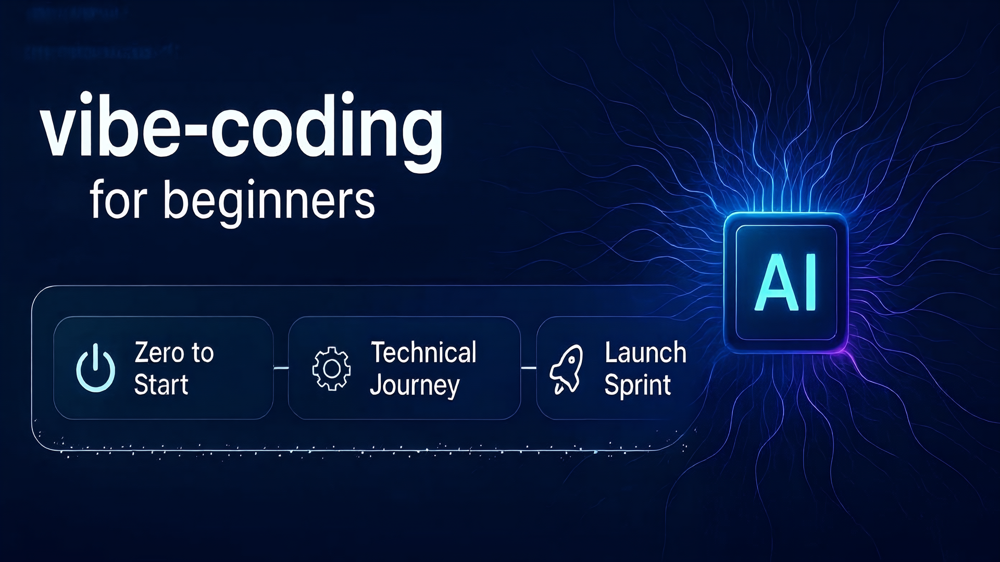

<h1 align="center">
  AI-Application-Development-for-Beginners  
  
  
</h1>

  

  <b>面向 AI 辅助开发（vibe-coding）初学者的实战教程</b>

此教程的目标用户是想要掌握 AI 辅助开发 (vibe-coding) 的初学者。通过本教程，你将学习到：

- 如何使用 AI 工具(如 Cursor)来提升开发效率
- 如何从 0 到 1 完整地开发和部署一个 AI 应用
- 如何通过实践项目来掌握必要的技术知识
- 如何培养端到端的工程思维和开发能力

无论你是在校学生还是刚入行的开发者,只要对 AI 应用开发感兴趣,都可以通过本教程快速入门并提升技能。

## 缘起

2025 年我越发感受到 AI 正在显著放大个体的能力。越来越多的小团队能够创造出令人惊叹的作品。然而,我也观察到一个现象:当前大多数公司的实习生仍然停留在打杂的工作层面,他们的创造力没有得到充分发挥。

基于这个观察,我在 3 月 27 号通过[即刻](https://m.okjike.com/originalPosts/67e4ba24070109da491c3822?s=ewoidSI6ICI2MjZhNDBhYjUyY2ViMzAwMTFmMzBkZjkiCn0=)发起了一个关于未来人才培养的实验。通过这篇文章,我找到了一些非常有潜力的同学参与其中。在实验过程中,我发现了以下问题:

1. 端到端项目经验的缺失
   - 在校生和应届毕业生普遍缺乏完整项目的开发经验
   - 他们往往只掌握了某些单点技能
   - 当面对一个需要从 0 到 1 完成的小项目时,往往不知从何下手

2. 教育内容的滞后性
   - 包括一些知名美国高校在内的教育机构,其课程设置尚未跟上 AI 时代的步伐
   - 像 Cursor 这样的新型生产力工具还未被纳入教学体系
   - 仍在沿用传统的教学模式和逻辑

通过持续的实验,我也获得了一些重要的发现:

1. 经验突破带来的质变
   - 完成第一个端到端项目是关键的突破点
   - 有位同学第一个项目耗时一个月仍未取得进展
   - 在获得帮助完成首个项目后,第二个 AI 应用仅用两天就完成开发和上线

2. AI 工具的赋能效果
   - Cursor 等工具能显著加速学习和创造过程
   - 通过实践项目来反向驱动知识学习,更容易获得正向反馈
   - 这种"实践先行"的方式能够更快地建立信心和能力

基于这些发现和验证,我决定将这套方法论开源,希望能帮助更多人受益。本教程的核心特色是:

- 强调端到端实践
- 全程采用 AI 辅助开发
- 覆盖从需求文档撰写到最终部署的完整流程
- 注重实战体验和能力培养

## 目录

> 本教程让我们以 ChatPDF 应用为例！带你体验从构思到上线的完整旅程，让你掌握如何开发一个具备用户系统和付费功能的 AI 应用。

### 第一部分：从零起步 🚀

1. 工具与环境：高效开发工具及环境配置指南
2. AI 沟通技巧：掌握与 AI 高效协作的方法
3. 原型设计：用原型图高效表达和沟通需求
4. 项目节奏：如何高效驱动项目进展，避免反复返工
5. 收获：构建第一个他人可直接访问的网站

### 第二部分：技术进阶之旅 💻

1. 前后端分离：理解现代 Web 架构
2. 前端美学：让 AI 协助打造美观的界面
3. 后端实现：业务逻辑的设计与开发
4. 数据处理：数据的存储、管理与应用
5. 收获：构建可以保存数据的网站

### 第三部分：构建拥有登录系统与支付系统的应用 🏃

1. 登录系统与支付系统集成

### 附录

- 常见问题解答
- 开发技巧与经验分享
- 扩展阅读与资源推荐

## 贡献指南

我们欢迎所有形式的贡献！请查看 [贡献指南](CONTRIBUTING.md) 了解详细的贡献流程和规范。

## 许可证

本项目采用 MIT 许可证 - 查看 [LICENSE](LICENSE) 文件了解详情。
