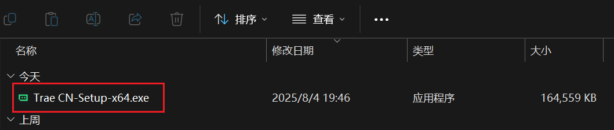
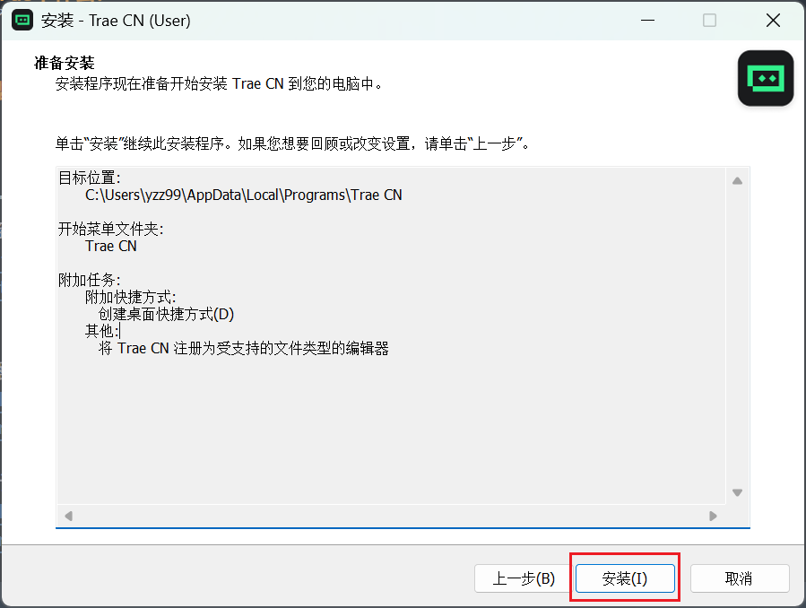
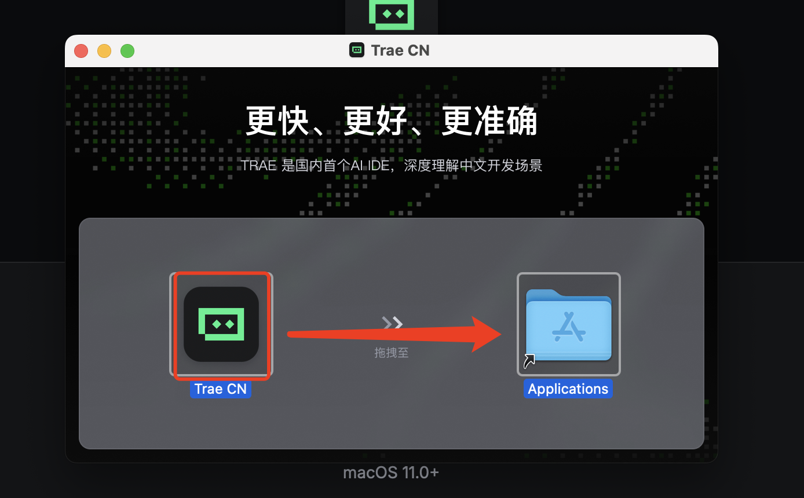
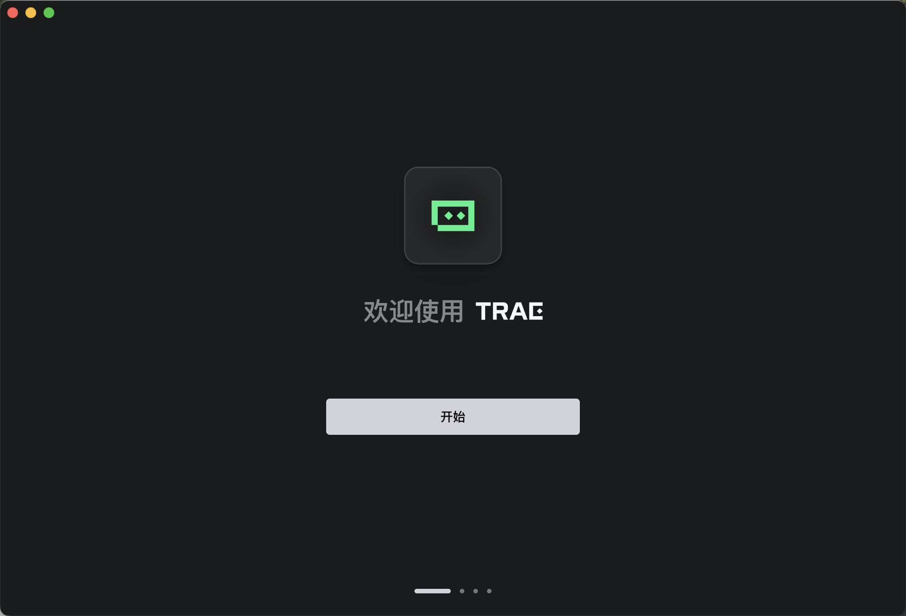
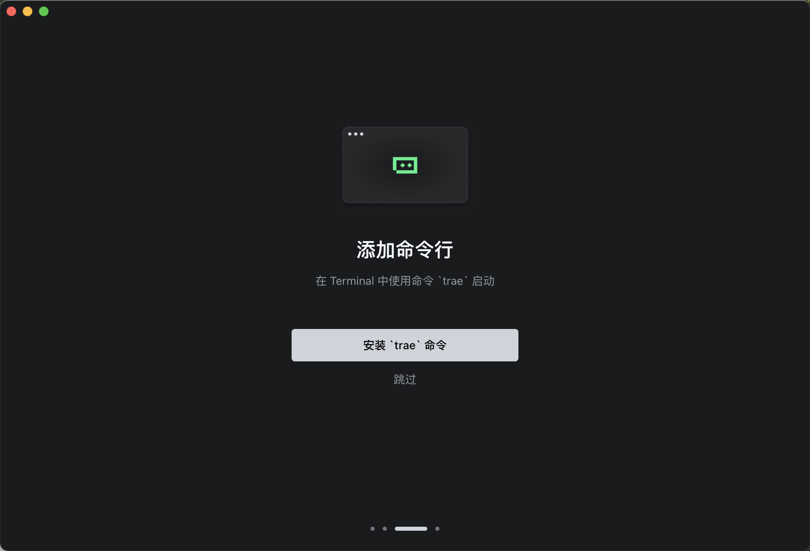
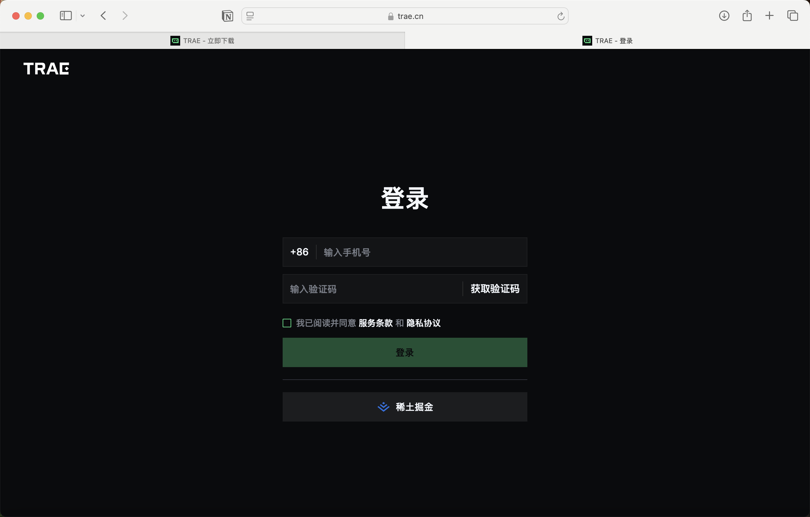
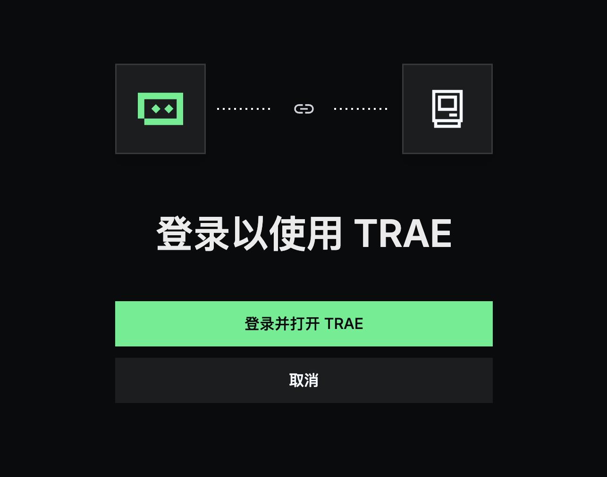

# 2. 如何上手 AI 编程？IDE 到底该怎么选？

## 2.1 🤔 为什么需要 IDE？就像为什么需要厨房一样

在上一章中，我们已经了解了产品开发的整体流程和前端、后端、数据库等基础概念。你可能会问："我已经有了想法，也知道了开发的大致步骤，接下来该怎么真正动手实现呢？"

这时候，你需要的就是一套"工具箱"——在编程世界里，这个工具箱就是 **IDE（Integrated Development Environment，集成开发环境）**。

### 2.1.1 没有 IDE 会怎样？就像在野外做饭

想象一下，如果你要在野外做一顿饭，你需要：
- 自己生火（搭建运行环境）
- 用石头当砧板（用记事本写代码）
- 用手当锅铲（手动调试）
- 用眼睛尝味道（肉眼检查错误）

**结果**：费时费力，容易出错，做出来的"菜"可能根本不能吃！

### 2.1.2 有了 IDE 会怎样？就像有了专业厨房

而有了 IDE，就像有了专业厨房：
- **炉灶已经点好**：运行环境自动配置好
- **厨具一应俱全**：代码编辑器、调试器、项目管理工具
- **智能助手帮忙**：AI 帮你写代码、找错误、提建议
- **一键出菜**：点击运行就能看到效果

**结果**：专注创作，高效开发，快速看到成果！

### 2.1.3 IDE 能为你做什么？

一个好用的 IDE 就像你的编程助手，它能：

- **📝 智能写代码**：自动补全、语法高亮、格式化
- **🔍 发现错误**：实时检查语法错误，给出修复建议
- **📁 管理项目**：组织文件结构，版本控制
- **🚀 一键运行**：点击就能运行程序，看到效果
- **🤖 AI 助手**：像有个懂技术的朋友随时帮你
- **🔧 调试工具**：找出程序哪里有问题，怎么修复

**简单理解**：IDE 就是让你从"手工作坊"升级到"现代化工厂"的关键工具！

## 2.2 🏠 传统 IDE vs AI 原生 IDE：为什么要选择 Trae？

### 2.2.1 传统 IDE：像传统厨房

传统的 IDE（比如 VSCode）就像传统厨房：

- **工具齐全**：各种锅碗瓢盆一应俱全
- **需要经验**：你得知道什么时候用什么工具
- **配置复杂**：需要安装各种插件，调整各种设置
- **学习曲线陡峭**：新手容易被复杂功能搞晕

虽然功能强大，但对初学者来说就像让你去五星级酒店的专业厨房做菜——工具太多反而不知道从哪开始。

### 2.2.2 AI 原生 IDE：像智能厨房

而 **Trae** 这样的 AI 原生 IDE，就像配备了智能助手的现代厨房：

- **AI 深度集成**：就像有个专业厨师在旁边指导
- **自然语言交互**：你可以直接说"我想做个登录页面"，它就能帮你生成代码
- **实时代码补全**：比传统 IDE 的代码提示更智能
- **错误解释和修复**：遇到问题，AI 能直接告诉你怎么解决

### 2.2.3 为什么选择 Trae？

**Trae** 是专门为 AI 时代设计的编程工具，它有以下几个突出优势：

#### 🎯 零配置开箱即用
- 不需要复杂的插件安装和配置
- 内置了 AI 编程所需的所有功能
- 界面简洁，专注于编程本身

#### 🤖 AI 优先的设计理念
- 可以直接用自然语言描述需求
- AI 能理解上下文，生成更准确的代码
- 支持多种 AI 模型，选择最适合的助手

#### 👶 初学者友好
- 界面简洁不复杂，降低学习门槛
- 内置教程和示例，边学边练
- 强大的错误提示和修复建议

#### 🤝 专为协作优化
- AI 就像你的编程伙伴，而不是工具
- 支持对话式编程，就像和朋友聊天一样写代码
- 能够解释代码逻辑，帮你理解每行代码的作用

**简单理解**：Trae 就像有了一个既懂技术又耐心的编程老师，随时在你身边指导你！

## 2.3 📥 下载和安装 Trae：三步搞定你的编程环境

现在你已经知道为什么需要 IDE 以及为什么选择 Trae，接下来就是安装和配置。整个过程就像买新手机一样简单！

### 2.3.1 第一步：下载 Trae

1. **访问官网**
   - 打开浏览器，访问 [Trae 官网](https://www.trae.cn/)
   - 点击**立即获取 Trae IDE** 按钮

2. **选择版本**
   - 根据你的操作系统选择对应版本：
     - **Windows**：下载 `.exe` 文件
     - **Mac**：下载 `.dmg` 文件
     - **Linux**：下载 `.AppImage` 文件

### 2.3.2 第二步：安装 Trae

#### Windows 用户：
1. **双击安装文件**
   - 双击下载的 `.exe` 文件开始安装
   - 选择**我同意此协议**，点击**下一步**
   

2. **开始安装**
   - 点击**安装**，等待安装完成
   - 安装成功后，点击**完成**，打开 Trae
   
   

3. **网络权限设置**
   - 如果出现**是否要允许公共网络和专用网络访问此应用**，点击**允许**
   

#### Mac 用户：
1. **打开安装文件**
   - 打开下载的 `.dmg` 文件
   - 将 Trae 拖拽到**应用程序**文件夹
   

2. **等待安装完成**
   - 看到这个进度则说明正在安装中
   

3. **完成安装**
   - 安装成功后，我们就可以在桌面上找到 Trae 了！
   - 打开 Trae 完成后续设置
   

### 2.3.3 第三步：首次配置

1. **欢迎界面**
   - 首次打开会有欢迎界面，点击**开始**进入下一步
   

2. **选择语言和主题**
   - 选择语言（推荐中文）和使用的主题
   - 点击**继续**
   

3. **安装命令行工具**
   - 点击**安装 trae 命令**
   - 这里涉及到通过命令行运行 Trae，至于什么是命令行，接下来的一节会告诉你
   

4. **注册登录**
   - 点击**登陆**注册并登陆账号，会跳转到浏览器账号注册页面
   
   

5. **完成登录**
   - 点击**登陆并打开 Trae**，即可进入到 Trae 的界面
   

6. **配置完成**
   - 当你看到这个界面的时候，所有的配置都已经完成
   - 现在可以开始编程了！
   

## 2.4 🎉 恭喜！你的编程环境已经准备好了

### 2.4.1 你现在拥有了什么？

- **✅ 专业的编程环境**：Trae IDE 已经安装并配置完成
- **✅ AI 编程助手**：随时可以帮你写代码、解答问题
- **✅ 零配置体验**：不需要安装额外插件，开箱即用
- **✅ 现代化界面**：简洁美观，专注编程本身

### 2.4.2 接下来你可以做什么？

1. **开始第一个项目**：用 AI 帮你创建第一个网页
2. **学习编程基础**：通过实际项目学习编程概念
3. **探索 AI 功能**：尝试用自然语言让 AI 生成代码
4. **加入社区**：与其他开发者交流学习

### 2.4.3 小贴士：如何更好地使用 Trae？

- **多用 AI 对话**：遇到问题就问问 AI，它会耐心解答
- **从简单开始**：先做简单的项目，逐步增加复杂度
- **不要害怕错误**：错误是学习的一部分，AI 会帮你解决
- **多实践**：理论结合实践，才能真正掌握编程

## 2.5 🚀 准备开始你的编程之旅

现在你已经：
- ✅ 理解了为什么需要 IDE
- ✅ 选择了最适合的 AI 原生 IDE
- ✅ 成功安装和配置了 Trae
- ✅ 拥有了完整的编程环境

**下一步**：下一章我们会用最简单的方式，手把手教你把开发环境配置好，并一步步完成安装。就像搭积木一样，跟着做就能顺利开始编程啦！

> 💡 **记住**：好的工具是成功的一半。现在你有了 Trae 这个强大的 AI 编程助手，接下来的学习之路会变得更加轻松和有趣！