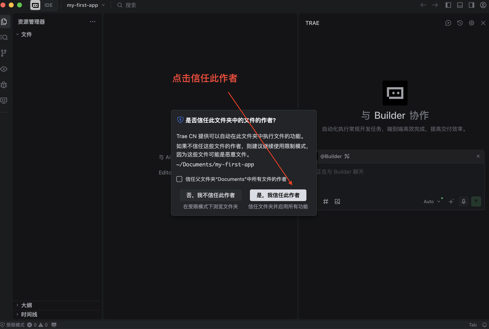
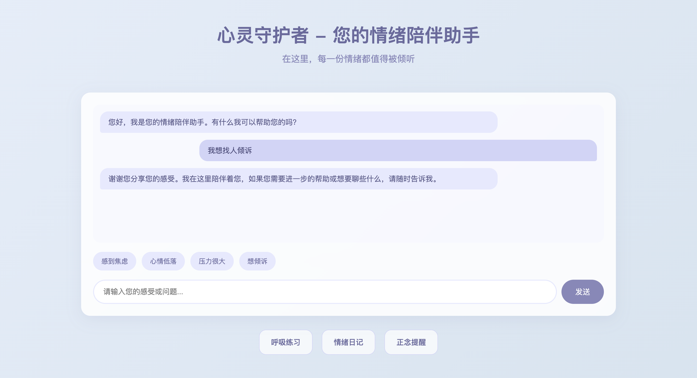

# 3. 开发第一个项目：从环境配置到第一个应用

## 3.1 🎯 这一章我们要做什么？

在上一章中，你已经成功安装并配置了 Trae IDE。现在，我们要完成最后一步：**配置开发环境**，然后**创建你的第一个应用程序**！

这一章的目标是：
- ✅ 安装 Node.js（让前端代码能运行）
- ✅ 配置开发环境
- ✅ 创建第一个项目
- ✅ 体验 AI 编程的完整流程
- ✅ 看到你的第一个应用在浏览器中运行

**简单理解**：就像买了新手机后，要安装微信、设置网络，然后才能开始使用一样！

## 3.2 🛠️ 配置开发环境：安装 Node.js

### 3.2.1 为什么需要 Node.js？

还记得我们在第一章学到的吗？前端代码需要在**运行环境**中才能运行。Node.js 就是让前端代码在电脑上运行的"发动机"。

**简单理解**：就像汽车需要发动机才能跑，你的网页应用需要 Node.js 才能运行！

### 3.2.2 安装 Node.js

1. **访问 Node.js 官网**
   - 打开浏览器，访问 [Node.js 官网](https://nodejs.org/)
   - 你会看到两个版本，选择**LTS版本**（长期支持版本，更稳定）

2. **下载安装包**
   - 点击绿色的**Download**按钮
   - 系统会自动识别你的操作系统并推荐对应版本
   - 下载完成后，你会得到一个安装文件

3. **安装 Node.js**
   - **Windows**：双击 `.msi` 文件，一路点击"下一步"即可
   - **Mac**：双击 `.pkg` 文件，按照提示安装
   - **Linux**：使用包管理器安装，如 `sudo apt install nodejs`

4. **验证安装**
   - 打开 Trae 的终端（Terminal）
   - 输入命令：`node --version`
   - 如果显示版本号（如 v18.17.0），说明安装成功！

### 3.2.4 🤔 什么是终端？为什么需要它？

看到这里，你可能会有疑问：

> "什么是终端？为什么不能直接点击安装，非要在黑框框里输入命令？"
> "这个黑框框看起来好复杂，我能不能不用它？"

别担心！让我用最简单的方式解释给你听。

#### 3.2.4.1 终端是什么？

**终端就像是电脑的"控制中心"**：

想象一下，你平时用电脑时：
- 用鼠标点击图标打开软件
- 用键盘输入文字
- 用触摸板滚动页面

这些都是**图形界面**的操作，就像在餐厅点菜时看菜单一样。

而**终端**就像是直接跟厨师说话：
- 不用看菜单，直接说"我要一个宫保鸡丁"
- 不用点击按钮，直接告诉电脑"运行这个程序"
- 不用鼠标拖拽，直接说"把这个文件移到那个文件夹"

#### 3.2.4.2 为什么需要终端？

**简单理解**：终端就像是电脑的"后台管理"：

1. **更直接**：直接告诉电脑要做什么，不用绕弯子
2. **更快速**：一个命令就能完成很多操作
3. **更强大**：能做很多图形界面做不到的事情
4. **更专业**：所有开发者都在用，学会了你就是"内行"

#### 3.2.4.3 终端在开发中的作用

**就像餐厅的后厨**：
- 前台（图形界面）：顾客看到的美观环境
- 后厨（终端）：厨师准备食材、控制火候的地方

在编程中：
- **前端**：用户看到的漂亮网页
- **终端**：开发者管理文件、运行程序的地方

#### 3.2.4.4 终端的基本操作

**不用担心，你只需要学会几个简单命令**：

```bash
# 查看当前位置（就像问"我现在在哪里？"）
pwd

# 查看文件夹内容（就像问"这个文件夹里有什么？"）
ls

# 进入文件夹（就像"打开这个文件夹"）
cd 文件夹名

# 创建文件夹（就像"新建一个文件夹"）
mkdir 文件夹名
```

**这些命令就像学开车时的基本操作**：
- 不需要记住所有操作
- 先学会基本的，慢慢就会了
- 有了AI帮助，学起来更容易

#### 3.2.4.5 为什么AI编程也需要终端？

**AI 虽然很聪明，但有些事情还是需要终端帮忙**：

1. **安装工具**：就像安装 Node.js，需要终端来验证
2. **运行程序**：让AI生成的代码真正"跑起来"
3. **管理文件**：组织你的项目文件
4. **解决问题**：当出现错误时，终端能告诉你具体问题

**简单理解**：AI 是"设计师"，终端是"施工队"：
- AI 帮你设计代码
- 终端帮你把代码变成真正的程序

#### 3.2.4.6 小白友好的终端体验

**好消息**：在 Trae 中，终端变得超级简单！

- **自动补全**：输入几个字母，按 Tab 键自动补全
- **历史记录**：按上下箭头可以重复之前的命令
- **错误提示**：如果命令错了，会告诉你哪里有问题
- **AI 帮助**：不懂的命令可以问 AI

**记住**：你不需要成为终端专家，只需要学会几个基本命令就够了！

### 3.2.3 安装完成后的效果

安装成功后，你现在拥有了：
- ✅ **Node.js 运行环境**：让 JavaScript 代码在电脑上运行
- ✅ **npm 包管理器**：自动安装和管理各种开发工具
- ✅ **完整的开发环境**：可以开始创建真正的应用程序了

## 3.3 🚀 创建第一个项目：Hello World

### 3.3.1 什么是 Hello World？

"Hello World"对于程序员来说，就像是婴儿说出的第一句"妈妈"一样意义重大。

它是每个程序员学习新编程语言时写的第一个程序，虽然功能极其简单（只是让电脑在屏幕上显示"Hello World"这几个字），但它代表着一个重要的仪式：你成功地让计算机听懂了你的指令并做出了回应，这个看似微不足道的成就，标志着你正式踏入了编程世界的大门。

**简单理解**：就像学开车时第一次成功启动汽车一样，虽然只是让车动起来，但那种成就感是无与伦比的！

### 3.3.2 我们的 Hello World 会更豪华

当然，我们既然有 Trae 的加持，因此我们的"Hello World"程序，与程序员创建的第一个程序相比会更豪华一些——我们会创建一个完整的网页应用，有漂亮的界面、动画效果，甚至一些简单的交互功能！

现在，让我们一起创建第一个程序！这就像做菜前先学会煮个鸡蛋一样，虽然简单，但能让你快速熟悉整个流程。

### 3.3.3 Step 1：创建新项目

**创建新项目**就像是准备盖房子时先圈出一块地、搭建工地围栏一样——它是在电脑上创建一个**专门的文件夹**，用来存放你即将编写的所有代码文件、图片、配置等资源，相当于给你的程序准备了一个独立的"家"。

#### 3.3.3.1 方法一：用图形界面创建（推荐小白）

1. **打开 Trae**

2. **点击 "打开文件夹"**
   

3. **创建项目文件夹**
   - 在你想要创建项目的位置，**新建文件夹创建一个空文件夹**
   - 命名为 `my-first-app`
   

4. **信任项目文件夹**
   - 此时，Trae 会自动将这个文件夹作为项目打开
   - 如果跳出**是否信任此文件夹中的文件的作者**，点击**是，我信任此作者**
   - 到这里，创建项目就完成了！
   

#### 3.3.3.2 方法二：用终端创建（体验终端操作）

**现在让我们用刚才学到的终端命令来创建项目**：

1. **打开 Trae 的终端**
   - 在 Trae 中打开终端（Terminal）
   - 你会看到黑色的窗口和闪烁的光标

2. **用终端命令创建项目**
   ```bash
   # 查看当前位置
   pwd
   
   # 创建项目文件夹
   mkdir my-first-app
   
   # 进入项目文件夹
   cd my-first-app
   
   # 查看是否创建成功
   ls
   ```

3. **在 Trae 中打开项目**
   - 回到 Trae 主界面
   - 点击 "打开文件夹"
   - 选择刚才创建的 `my-first-app` 文件夹

**恭喜！你刚刚用终端创建了你的第一个项目！**

**两种方法的对比**：
- **图形界面**：简单直观，适合初学者
- **终端**：更专业，效率更高，适合复杂项目

**记住**：两种方法都可以，选择你觉得舒服的就行！

### 3.3.4 Step 2：和 AI 对话，生成第一个页面

这个时候，你的项目里一个文件都没有。

对于大家而言，激动人心的时刻来了，这是最有趣的部分！你可以直接用自然语言告诉 AI 你想要什么。接下来你就可以看到你的项目里填充的文件了。

1. **打开 AI 对话框**
   - 在 Trae 界面的右侧与 Builder 协作

2. **描述你的需求**
   - 这里以第一章开发心理健康助手的场景为例
   - 在对话框中输入以下提示词：

```markdown
## 提示词：创建心理健康助手网页

帮我创建一个心理健康助手的单页面网站，要求如下：

### 基本要求
- 创建三个文件，一个 HTML 文件，一个 CSS 文件和一个 JavaScript 文件
- HTML 文件中引入 CSS 文件和 JavaScript 文件
- 不需要后端，所有功能都在前端实现
- 界面要有呼吸感和灵动效果，整体美观舒适

### 页面结构
1. **顶部区域**：
   - 网站标题："心灵守护者 - 您的情绪陪伴助手"
   - 副标题："在这里，每一份情绪都值得被倾听"

2. **主聊天区域**：
   - 左侧或上方显示聊天历史记录
   - 底部有输入框，让用户输入他们的感受或问题
   - 发送按钮要明显且友好

3. **预设快速选项**：
   - 提供几个常见情绪按钮，如："感到焦虑"、"心情低落"、"压力很大"、"想倾诉"
   - 点击后自动在输入框填入相关文字

### 视觉设计
- **配色方案**：使用柔和的色调，如淡紫色、浅蓝色、米白色等治愈系颜色
- **动画效果**：
  - 背景要有缓慢的渐变动画，模拟呼吸的节奏
  - 消息出现时要有淡入效果
  - 输入框获得焦点时有轻微的发光效果
  - 按钮悬停时有温柔的放大效果

### 模拟回复功能
请预设至少 10 条心理咨询师风格的回复，根据用户输入的关键词匹配并显示。例如：
- 如果用户提到"焦虑"、"紧张"、"担心"等词，回复类似："我理解您现在感到焦虑，这是很正常的情绪反应。让我们一起做个深呼吸练习，慢慢地吸气...保持...然后缓缓呼出..."
- 如果用户提到"累"、"疲惫"、"没力气"，回复类似："听起来您最近承受了很多压力，感到疲惫是身体在提醒我们需要休息了。您最近有好好照顾自己吗？"
- 如果用户提到"孤独"、"寂寞"、"没人理解"，回复类似："感到孤独是一种很深刻的情绪体验，我想让您知道，此刻我在这里陪伴着您，您并不是一个人..."

### 特殊功能
1. **呼吸练习引导**：
   - 添加一个圆形的呼吸指示器
   - 点击后开始 4-7-8 呼吸法动画引导

2. **情绪日记**：
   - 用户可以记录当前的情绪状态（用 emoji 表情选择）
   - 显示最近 7 天的情绪变化

3. **正念提醒**：
   - 每隔一段时间，温柔地提醒用户关注当下

### 交互细节
- 助手回复要有打字机效果，一个字一个字地显示
- 用户发送消息后，显示"助手正在思考..."的温柔提示
- 所有的交互都要给人温暖、被理解的感觉

### 响应式设计
- 确保在手机、平板和电脑上都能完美显示
- 手机版本要特别优化输入体验
```

3. **AI 生成代码**
   - AI 会自动生成 HTML、CSS 和 JavaScript 代码
   - 代码会出现在对应的文件中
   - 你可以看到 Trae 创建了`index.html`（页面结构）、`style.css`（页面样式）、`script.js`（交互功能）三个文件

4. **接受更改**
   - 创建好三个文件之后，点击**全部接受**
   - 然后点击右下角的**停止**按钮结束本次对话
   

### 3.3.5 Step 3：理解生成的代码

到这里，恭喜大家成功入门**AI 前端开发**了！你在和 AI 对话的过程中，就是在向 AI 表明"我要绘制应用界面"，还记得"前端"是什么意思吗？接下来带大家理解这三个文件的含义。

1. **HTML 文件**：就像房子的骨架
   - `<h1>` 是大标题
   - `<p>` 是段落文字
   - `<button>` 是按钮
   - `<div>` 是容器，用来放其他元素

2. **CSS 文件**：就像房子的装修
   - 设置颜色、字体、大小
   - 创建渐变背景
   - 添加阴影和圆角效果

3. **JavaScript 文件**：就像房子的电路
   - 监听按钮点击事件
   - 获取当前时间并显示

聪明的你可能要问了：这都写完了，我该如何运行呢？

### 3.3.6 Step 4：运行代码

现在到了最激动人心的时刻——让你的网页"跑起来"！

#### 3.3.6.1 方法一：直接打开文件（最简单）

**适合小白的方法**：
1. 打开之前创建的`my-first-app`文件夹
2. 找到`index.html`文件
3. 双击打开
4. 系统会自动调用**浏览器**运行你的代码
5. 浏览器会自动打开一个新标签，并显示你的网页



#### 3.3.6.2 方法二：用终端运行（体验专业开发）

**现在让我们用终端来运行你的网页**：

1. **打开终端**
   - 在 Trae 中打开终端
   - 确保你在项目文件夹中（如果不是，用 `cd my-first-app` 进入）

2. **用终端打开网页**
   ```bash
   # Windows 用户：
   start index.html
   
   # Mac 用户：
   open index.html
   
   # Linux 用户：
   xdg-open index.html
   ```

3. **查看效果**
   - 浏览器会自动打开
   - 显示你的网页

**两种方法的对比**：
- **直接双击**：简单快速，适合查看效果
- **终端命令**：更专业，为以后学习做准备

#### 3.3.6.3 方法三：启动本地服务器（高级体验）

**如果你想体验更专业的开发方式**：

1. **在终端中启动服务器**
   ```bash
   # 如果你有 Python（Mac/Linux 通常有）：
   python -m http.server 8000
   
   # 或者使用 Node.js（如果安装了）：
   npx serve .
   ```

2. **在浏览器中访问**
   - 打开浏览器
   - 访问 `http://localhost:8000`
   - 你会看到你的网页

**为什么需要本地服务器？**
- **更真实**：模拟真实的网站环境
- **更专业**：这是开发者常用的方式
- **更强大**：支持更多功能（如 AJAX 请求）

**恭喜！你已经成功创建了一个简单的网页应用啦！**

**现在你体验到了什么？**
- ✅ 用 AI 生成代码
- ✅ 用终端管理项目
- ✅ 用浏览器查看效果
- ✅ 体验了完整的开发流程

## 3.4 🎨 AI 编程的最佳实践：提示词是门艺术

看到这里，可能有的学习者会问，**你的提示词**看起来好复杂，是你自己写的吗？

我的回答是，当然不是，是 Trae 自带提示词优化功能帮助我优化的。

看到这个小按钮了吗，哪怕你输入的提示词再简单，Trae 也会帮你优化成你想要的样子。


什么？简单的提示词也不知道怎么表达？

教你一招，**想象你在跟一个很聪明但没见过你项目的朋友解释**，你会怎么说？颜色要什么样的？布局怎么摆？有什么特殊功能？越具体越好。然后输入到 Trae 中，Trae 会自动给你优化。

### 3.4.1 通用提示词模板

还有的学习者可能会问，如果我想开发一个**提醒我运动的助手**，应该如何开始呢？

别急，我这里为大家准备好了一份**通用解决方案**，你只需要在我的提示词的基础上**填空（修改中括号里的内容）**就好：

```markdown
## 提示词：创建【助手类型】网页

帮我创建一个【助手名称】的单页面网站，要求如下：

### 基本要求
- 创建三个文件，一个 HTML 文件，一个 CSS 文件和一个 JavaScript 文件
- HTML 文件中引入 CSS 文件和 JavaScript 文件
- 不需要后端，所有功能都在前端实现
- 界面要【形容词 1】和【形容词 2】，整体【风格描述】

### 页面结构
1. **顶部区域**：
   - 网站标题："【主标题】"
   - 副标题："【副标题/口号】"

2. **主交互区域**：
   - 【布局位置】显示【交互内容】
   - 底部有输入框，让用户输入他们的【输入内容类型】
   - 【按钮名称】按钮要【按钮特点】

3. **预设快速选项**：
   - 提供几个常见【选项类型】按钮，如：【选项 1】、【选项 2】、【选项 3】、【选项 4】
   - 点击后自动在输入框填入相关文字

### 视觉设计
- **配色方案**：使用【色彩风格】的色调，如【颜色 1】、【颜色 2】、【颜色 3】等【风格形容】颜色
- **动画效果**：
  - 背景要有【动画类型】动画，【动画描述】
  - 【元素】出现时要有【效果类型】效果
  - 输入框获得焦点时有【焦点效果】效果
  - 按钮悬停时有【悬停效果】效果

### 模拟回复功能
请预设至少 10 条【角色风格】风格的回复，根据用户输入的关键词匹配并显示。例如：
- 如果用户提到【关键词组 1】等词，回复类似："【回复内容 1】"
- 如果用户提到【关键词组 2】，回复类似："【回复内容 2】"
- 如果用户提到【关键词组 3】，回复类似："【回复内容 3】"

### 特殊功能
1. **【功能 1 名称】**：
   - 【功能 1 描述】
   - 【功能 1 交互方式】

2. **【功能 2 名称】**：
   - 【功能 2 描述】
   - 【功能 2 展示方式】

3. **【功能 3 名称】**：
   - 【功能 3 描述】
   - 【功能 3 触发方式】

### 交互细节
- 助手回复要有【效果类型】效果，【效果具体描述】
- 用户发送消息后，显示"【等待提示文字】"的【形容词】提示
- 所有的交互都要给人【感受 1】、【感受 2】的感觉

### 响应式设计
- 确保在手机、平板和电脑上都能完美显示
- 手机版本要特别优化【需要优化的体验】体验
```

## 3.5 🎉 恭喜！你已经成功入门 AI 编程

### 3.5.1 你现在已经掌握了什么？

恭喜你！你已经成功：
- ✅ 安装和配置了 Trae IDE
- ✅ 安装了 Node.js 运行环境
- ✅ 创建了第一个 Hello World 应用
- ✅ 学会了基本的 AI 编程对话
- ✅ 理解了前端代码的基本结构
- ✅ 掌握了简单的提示词优化方法

### 3.5.2 体验到了什么？

通过这个简单的项目，你应该已经体验到了：

1. **AI 编程的魔力**：用自然语言就能生成代码
2. **快速迭代的乐趣**：几分钟就能看到效果
3. **创造的成就感**：做出了一个真正能用的应用
4. **学习的轻松感**：不需要死记硬背语法

### 3.5.3 下一步学习方向

在接下来的章节中，我们将学习：

1. **终端和命令行基础**：学会用命令行管理项目
2. **理解项目结构**：深入了解文件和文件夹的组织
3. **调试和错误处理**：当出现问题时如何快速解决
4. **添加更多功能**：让你的应用变得更加实用

## 3.6 💭 本章小结

在这一节中，我们学会了：

- **环境配置**：安装 Node.js，搭建完整的开发环境
- **终端基础**：理解什么是终端，学会基本命令
- **项目创建**：用图形界面和终端两种方式创建项目
- **AI 协作编程**：用自然语言描述需求，让 AI 生成代码
- **理解代码结构**：HTML、CSS、JavaScript 的基本作用
- **运行和测试**：用多种方式让应用在浏览器中运行
- **提示词技巧**：如何更好地与 AI 对话

### 3.6.1 说点真心话

AI 编程确实降低了入门门槛。以前总觉得编程是天才们的游戏，现在发现其实每个人都能参与。你不需要记住编程语言的语法，不需要背诵文档（这又不是考试），你只需要清楚自己想要什么，剩下的 AI 会帮你搞定。

但这不意味着就不用学习了。**AI 是工具，真正的创意和想法还是要靠自己**。就像有了计算器，你还是得知道什么时候该加减乘除。

**关于终端**：很多小白一开始看到"黑框框"会害怕，觉得太复杂。但通过今天的体验，你应该发现终端其实没那么可怕。它就像是电脑的"后台管理"，学会几个基本命令就能大大提高效率。而且有了 AI 的帮助，不懂的命令随时可以问。

最后想说，如果你也在犹豫要不要开始学编程，别想太多，直接上手试试。下载个 Trae，跟 AI 聊聊天，做个小页面。你会发现，原来创造一个属于自己的数字作品，真的没那么难。谁知道呢，说不定下一个改变世界的应用，就是从你的"Hello World"开始的。

**准备好学习更多技能了吗？**

在下一节中，我们将学习如何使用终端（命令行），这是每个开发者都需要掌握的基本技能。别担心，我们会用最简单的方式带你入门！

---

## 3.7 🤔 思考题

1. 试着用 AI 修改你的 Hello World 页面，添加一个新功能（比如背景音乐、计算器、天气显示等）

2. 观察 AI 生成代码的过程，你觉得哪些部分是 HTML、CSS、JavaScript 分别负责的？

3. 如果你要向朋友介绍 AI 编程的优势，你会怎么说？

4. 尝试用通用提示词模板创建一个不同主题的助手应用，比如学习助手、健身助手等。

_完成这些思考题，会帮助你更好地理解 AI 编程的核心概念，为后续学习打下坚实基础。_