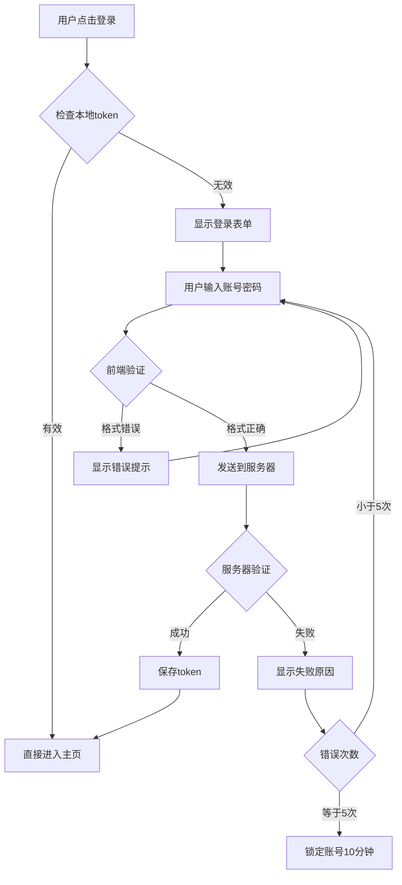
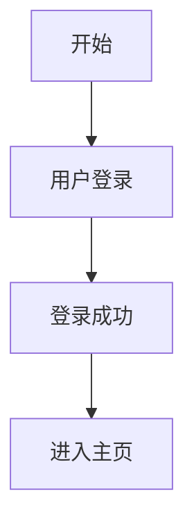
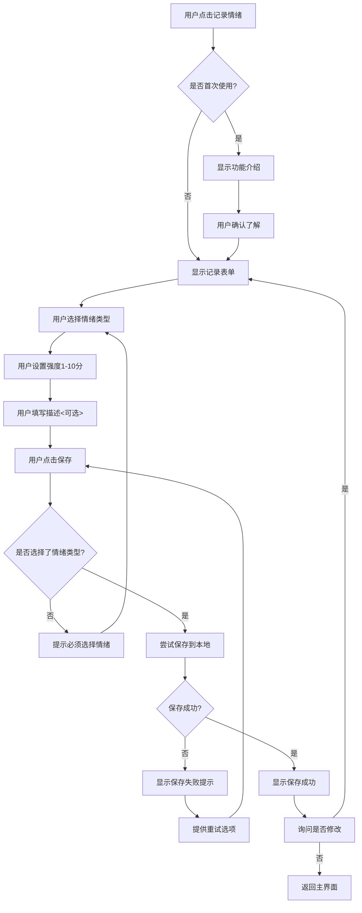

# 脑子里画面超清晰，为啥还要画什么流程图啊？

## 引言：又一个常见的困惑

完成了前面三章的学习，你已经掌握了 AI 协作技能，也写出了清晰的用户故事。现在你可能会想：

> "我已经把用户故事写得很详细了，脑子里对整个应用的流程超级清楚，每个步骤我都想得明明白白的，为什么还要花时间画什么流程图？直接开始做不就行了？"

> "画流程图看起来好麻烦，而且我又不是产品经理，我就是想做个简单的应用，有必要搞得这么正式吗？"

我自己就经常遇到这种情况。脑子里明明想得特别清楚，整个应用怎么运行、用户怎么操作，每个细节都在脑海里过了好几遍。

可一旦真正动手做起来，就发现事情没那么简单了。

## 一个比喻：找路

想象你要给朋友指路去一个地方。你脑子里路线特清楚："出门右转，走到红绿灯左拐，看到星巴克再右转就到了。" 听起来很简单对吧？

但如果朋友问你：

- "要是那个红绿灯在修路怎么办？"
- "星巴克关门了我怎么认？"
- "右转之后走多远？"
- "路上有停车场吗？"

你突然发现，原来"清楚"的路线其实有好多细节没考虑到。

流程图就像是一份详细的地图，不仅标出主路，还标明了所有岔路口、可能的障碍、备选方案。有了它，不管遇到什么情况都能应对。

## 脑子里想的 vs 实际开发的差距

我给你看个特别实际的例子。就拿**用户登录**这个看似简单的功能来说：

你脑子里想的：用户输入账号密码 → 点登录 → 进入系统

实际开发时会遇到的问题（因为你永远都不知道使用者输入了什么）：

- 用户输入了邮箱还是手机号？
- 密码输错了显示什么提示？
- 连续输错 5 次要不要锁定？
- 登录中网络突然断了咋办？
- 登录成功后跳转到哪个页面？
- 下次打开要不要自动登录？
- 忘记密码的按钮放哪里？

突然间，一个"简单"的登录功能变成了十几个需要决策的点。如果没有流程图，你就得边写边想，写一半发现逻辑不对又得推倒重来。

## 流程图最大的价值：让 AI 准确理解你

这是我觉得最重要的一点。当你跟 AI 说"帮我做个登录功能"时，AI 可能会给你一个最基础的版本。但如果你给 AI 一个流程图：



AI 立刻就能理解你要的是什么，包括自动登录、错误处理、防暴力破解等所有细节。这样生成的代码质量会高很多。

看到这里你可能会问，你这是一堆代码啊，这不是图啊。别急，打开[这个链接](https://mermaid-live.nodejs.cn/edit#pako:eNplkF9v0lAYxr9Kc64ZKWW00AsTB_s_77yycNGMAou0XWob_7Qkw8RZFqFTIQ7BANkwRMfABDMdc_synNP2W1h6OuJiL5rz9P29z_P06GBXzgqABbmi_Hy3wCsq8TiVlgjvecjZ9QEyL-3Xv-Hbqd2cwj-NDLG09IBY0dHpAer0Ufsctseq_FSQSnhnZT43ULuCGqZBJDm7NUG1vnPbgm_6s19Tt_czcw_81PXBFIdObuyzKxzi9Aaw2gjAlJ-4GnRxbj56Ts7kK7Qu4ejQ7pYDbNXH1nRYqdrfR-63d86oHHRaw1Hda3htufWmMxoZxHoQiDWyjr1z5n8cDU_t3oVBbHDQeu8elKE5Ru0qPOrB5iDA13E_LDZ8sakvoHtFNrGzeQyPOgaxxc1uv8DhiX99mX8JePbDmfQNYjsoiTWsdWCrG4BbflASi21f7OjBz5z3UGMcRO5gw7E1u6rFvIlx1xQP7GFlMXjEufUyvPiMLzdCQvPQ_dDJgBDIK3tZwKqKJoSAKCgiP5dAnxulgVoQRCENWO-YFXK8VlTTIC2VvLV9Xnoiy-LdpiJr-QJgc3zxmae0_SyvCqk9Pq_w4uKrIkhZQUnKmqQClln2PQCrgxeAjZKJME1GojRJk7EERUZD4CVgqXiYpuJkJEZTETqxzETpUgi88lPJcIKkGIph4t7bg-Klv725RsM)就能看到原图了。

看完了你可能还会问，这个图是你自己画的？当然不是，是用 AI 自动生成的。要想讲透这一点，涉及到 mermaid 语法。

## 什么是 Mermaid 语法？

在学习如何画流程图之前，我们需要了解一个神奇的工具——**Mermaid**。

### Mermaid 简介

**Mermaid**是一种用文本描述图表的标记语言，就像用文字"画"图一样。你只需要写几行简单的代码，就能自动生成漂亮的流程图、时序图、甘特图等。

### 为什么选择 Mermaid？

1. **AI 友好**：AI 可以直接生成 Mermaid 代码，无需手工绘制（这个是最主要的原因，后面会告诉大家如何画这种流程图）
2. **代码化**：可以复制、修改、版本控制
3. **渲染美观**：自动生成专业的流程图样式

**举个简单例子**：

你写这样的文字：

```
flowchart TD
    A[开始] --> B[用户登录]
    B --> C[登录成功]
    C --> D[进入主页]
```

就能自动生成这样的流程图：



### 为什么选择 Mermaid？

**对比传统绘图方式**：

| 传统方式                   | Mermaid 方式                 |
| -------------------------- | ---------------------------- |
| 需要学习复杂的绘图软件     | 只需要写简单的文字代码       |
| 修改图表很麻烦，要重新拖拽 | 改几个字就能更新图表         |
| 难以与他人协作和分享       | 可以复制粘贴，版本控制       |
| AI 不容易理解和生成        | AI 可以直接生成 Mermaid 代码 |
| 图表样式需要手动调整       | 自动生成统一美观的样式       |

### 如何查看 Mermaid 流程图？

当你看到或写出 Mermaid 代码后，需要用专门的工具来查看实际的图表效果。

**推荐使用在线工具**：
🔗 **https://mermaid-live.nodejs.cn/edit**

**使用方法**：

1. 打开上面的链接
2. 在左侧编辑器中粘贴你的 Mermaid 代码
3. 右侧会实时显示生成的流程图
4. 可以导出为 PNG、SVG 等格式

**快速体验**：
复制下面的代码到在线编辑器试试：

```
flowchart TD
    A[我有一个想法] --> B[写用户故事]
    B --> C[画流程图]
    C --> D[开始开发]
    D --> E[成功上线]
```

你会看到一个完整的产品开发流程图！

**重要提示**：在后面的学习中，每当你看到

```mermaid
...代码...
```

这样的代码块时，都可以复制到 https://mermaid-live.nodejs.cn/edit 查看实际效果！

## 如何让 AI 帮你画流程图：先写后画

掌握了基础语法后，你就可以让 AI 成为你的流程图绘制助手了！

### 基础的 AI 画图指令

**标准模板**：

```
请用Mermaid语法画一个[功能名称]的流程图，包含以下步骤：
1. [步骤1]
2. [步骤2]
3. [步骤3]
...

需要考虑的异常情况：
- [异常1]
- [异常2]

请确保流程图包含开始和结束节点，以及所有的判断分支。
```

### 实战示例：让 AI 画情绪记录流程图

**你的指令**：

```
请用Mermaid语法画一个"用户记录每日情绪"的流程图，包含以下步骤：

主要流程：
1. 用户点击"记录情绪"按钮
2. 显示情绪记录表单
3. 用户选择情绪类型（开心/难过/焦虑/平静）
4. 用户设置情绪强度（1-10分）
5. 用户可选填写情绪描述
6. 用户点击保存
7. 保存到本地存储
8. 显示保存成功提示

需要考虑的异常情况：
- 用户首次使用，需要功能说明
- 用户未选择情绪类型就点保存
- 本地存储失败
- 用户想要修改刚保存的记录

请确保流程图清晰易懂，包含所有判断节点和错误处理路径。
```

**AI 可能的回复**：



[效果预览](https://mermaid-live.nodejs.cn/edit#pako:eNpVkdlu2kAUhl_FmmtANma1qlQNZN-rXtVwYQUDkVgi16gLIFWNQmgpggtoqRJSkVKatqkhUqU2uOCX8Xh5i5rxEOG5mjP6zvn_808RHOYTPGBAMpN_fpjmBJF4Eo3lCOs8YvXWtVb9o7-5g2eyIY3gpK2dnOryjzjhdi8Ry0WtM4TNgTn4oN301Ili4Q_Ldu8yIkoWUCIirNaZ6v0xfPfZOJmock2X63EHZg0pEVGM2UJG7xrW2xiLIGxl7qcnGVJfHVeMb18wsIIA7DuKilVMm6_farXvtm_9VoaXNdyzirA1jBnSVJ9I8N8YjgeUmyJhtYK5NcStYw72fsLKJ63RMJTRA9gYWuOXMLiOwA1HaqrShb86GNhAwOY8NmTMWmPR2zy_zYVgtlit0Zzlp5yaPXlxn7gDRmFvs3DUNYZtWxhWR9rFDbwYYXLLjsYutlGxU7RRrdq0Pmiuv7Ogv4s_Bo_s3xq_v9qO4g4Y6e85YHsoxnYRtj_bRp2em2d1y6a1jdm7w8AeAg5YY3hlfpTslFRF0lpzYN9O2C4OFlSjjifk-jFrKC14fqn-lfX2e7N7FQcukBKOEoARhQLvAlleyHKzEhRn3TEgpvksHwOMdU3wSa6QEWMglitbbcdc7mk-n513CvlCKg2YJJd5ZlWF4wQn8tEjLiVw2ftXgc8leCGSL-REwPhICg0BTBG8AAxFBTxBOuD10n6aDJOhEO0CLwHjD3oCQZr0--lgKBQIk2Ff2QVeIV2vxxcO034vRfsoyuvzBcr_AR3VqXU)

### AI 画图的最佳实践

1. **先描述再画图**：详细描述需求，让 AI 充分理解
2. **分层次画图**：先画主流程，再添加细节
3. **多轮迭代**：不断优化和完善
4. **验证逻辑**：让 AI 检查流程的完整性
5. **保存模板**：把好用的提示词保存下来重复使用

## 流程图工具推荐

当然，除了 mermaid 之外，还有其他工具也能够画流程图。

- **draw.io**：免费，功能强大
- **ProcessOn**：中文界面，简单易用

## 本章小结

我知道画流程图感觉像是在"浪费时间"，特别是当你急着想看到成果的时候。但相信我，这个时间投资绝对值得。就像磨刀不误砍柴工，花 1 小时画流程图，能帮你节省 10 小时的返工时间。

而且你不需要画得多专业，哪怕是在纸上画个草图，或者用最简单的方块和箭头，只要能把逻辑理清楚就行。重点不是图画得多漂亮，而是把脑子里模糊的想法变成清晰的步骤。

试试看吧，就从你最想做的那个功能开始，花 20 分钟画个简单的流程图。我保证，你会发现很多之前没想到的细节，而这些细节恰恰决定了你的应用是"能用"还是"好用"。

**从"我想得很清楚"到"我画得很清楚"，这是从想法到产品的关键一步。**

在下一章中，我们将正式进入"筑基期"，开始学习前端、后端、数据库等基础概念，并用 AI 创建我们的第一个 MVP。

---

## 思考题

1. 尝试为"用户查看情绪历史"功能画一个完整的流程图
2. 对比你的流程图和我的示例，找出可以改进的地方
3. 想象你要向一个从未用过手机的人解释如何使用微信，你会怎么画流程图？

_完成这些练习后，你就掌握了将需求转化为可视化设计的核心技能！_

现在，"练气期"的四个基础章节全部完成。你已经掌握了：

- ✅ 为什么要学开发（动机建立）
- ✅ 如何与 AI 协作（工具掌握）
- ✅ 如何写用户故事（需求分析）
- ✅ 如何画流程图（逻辑设计）

准备好进入"筑基期"，开始真正的动手实践了吗？
