# 如何上手 AI 编程？IDE 到底该怎么选？

## 引言：工具选对了，成功就一半了

在上一节中，我们用餐厅的比喻了解了前端、后端、数据库的概念。现在你可能会想："概念我懂了，那我要怎么开始动手呢？"

这就像你知道了做菜需要锅灶、食材、调料，但你还需要一个**好厨房**才能开始烹饪。在编程世界里，这个"厨房"就是 **IDE（integrated development environment，集成开发环境）**。

但是面对市面上眼花缭乱的开发工具，很多初学者都会有这样的困惑：

> "AI 编程和传统编程有什么区别？是不是需要特殊的工具？"

> "我听说有 VSCode、WebStorm、Sublime Text...还有什么 Vim、Emacs，到底选哪个？"

> "网上教程都说 VSCode 好用，但我看着密密麻麻的界面就头晕，有没有更简单的？"

其实大家有这样的困惑很正常，程序员群体则会围绕“最好的 IDE 是什么”这个话题，就像为爱豆打榜一样展开各种口水战。

我们与程序员不同，我们所需要的是**AI 驱动的 IDE**，传统 IDE 就像专业厨房，刀具几十把，各种专业设备，对大厨来说是天堂，对新手来说简直是地狱。你想煎个鸡蛋，结果发现光是找平底锅就要在一堆器具里翻半天。

而我们的目的是借助 AI 的力量，帮助我们开发属于自己的应用，不要因为工具选择本末倒置。

今天我们就来解决这些问题。我会告诉你为什么在 AI 时代，选择一款**专为 AI 设计的 IDE** 会让你的学习之路事半功倍。

## 传统 IDE vs AI 原生 IDE：为什么要选择 Trae？

### 🏠 传统 IDE：像传统厨房

传统的 IDE（比如 VSCode）就像传统厨房：

- **工具齐全**：各种锅碗瓢盆一应俱全
- **需要经验**：你得知道什么时候用什么工具
- **配置复杂**：需要安装各种插件，调整各种设置
- **学习曲线陡峭**：新手容易被复杂功能搞晕

虽然功能强大，但对初学者来说就像让你去五星级酒店的专业厨房做菜——工具太多反而不知道从哪开始。

### 🤖 AI 原生 IDE：像智能厨房

而 **Trae** 这样的 AI 原生 IDE，就像配备了智能助手的现代厨房：

- **AI 深度集成**：就像有个专业厨师在旁边指导
- **自然语言交互**：你可以直接说"我想做个登录页面"，它就能帮你生成代码
- **实时代码补全**：比传统 IDE 的代码提示更智能
- **错误解释和修复**：遇到问题，AI 能直接告诉你怎么解决

### 🎯 为什么选择 Trae？

**Trae** 是专门为 AI 时代设计的编程工具，它有以下几个突出优势：

1. **零配置开箱即用**

   - 不需要复杂的插件安装和配置
   - 内置了 AI 编程所需的所有功能
   - 界面简洁，专注于编程本身

2. **AI 优先的设计理念**

   - 可以直接用自然语言描述需求
   - AI 能理解上下文，生成更准确的代码
   - 支持多种 AI 模型，选择最适合的助手

3. **初学者友好**

   - 界面简洁不复杂，降低学习门槛
   - 内置教程和示例，边学边练
   - 强大的错误提示和修复建议

4. **专为协作优化**
   - AI 就像你的编程伙伴，而不是工具
   - 支持对话式编程，就像和朋友聊天一样写代码
   - 能够解释代码逻辑，帮你理解每行代码的作用

## 下载和安装 Trae

### 📥 获取 Trae

1. **访问官网并下载安装包**

   - 打开浏览器，访问 [Trae 官网](https://www.trae.cn/)
   - 选择适合你操作系统的版本（Windows/Mac/Linux），点击**立即获取 Trae IDE** 按钮，即可下载安装包

2. **安装程序**

   - **Windows**：双击 `.exe` 文件，按照向导安装
     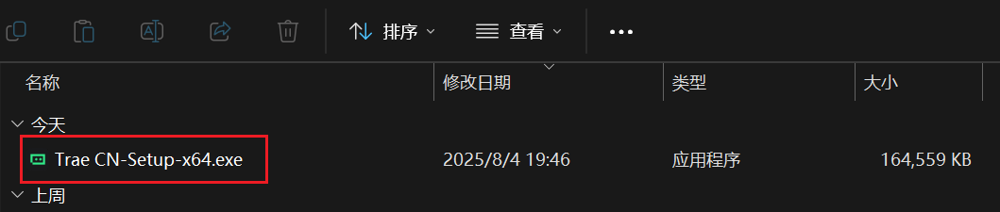
     选择**我同意此协议**之后点击**下一步**
     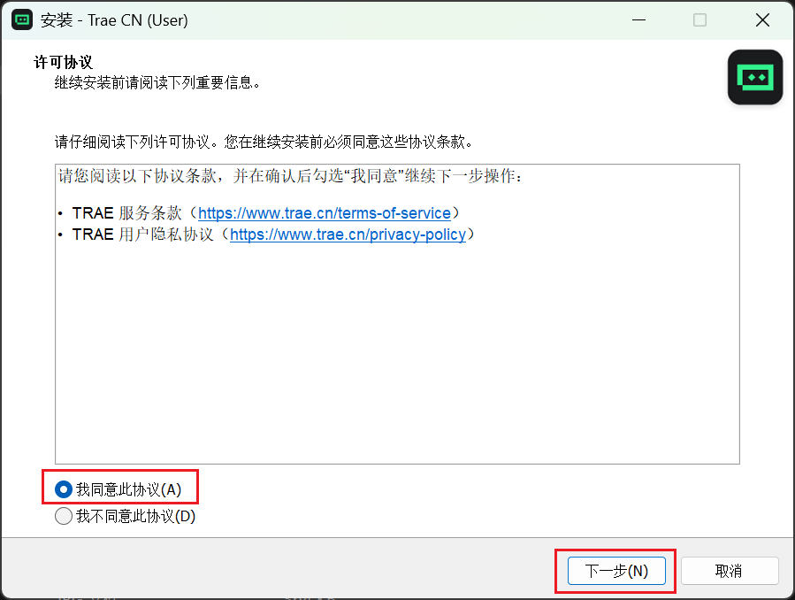
     点击**安装**，安装成功后，点击**完成**，打开 Trae 完成后续设置
     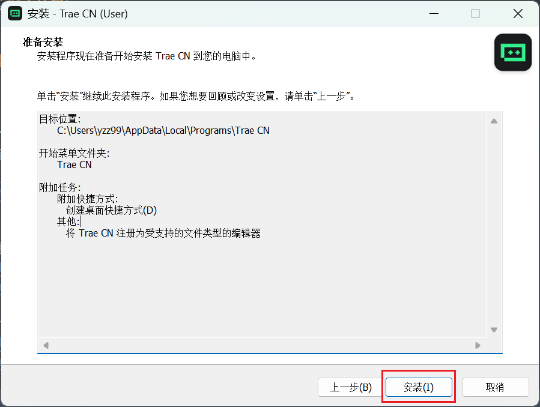
     如果出现**是否要允许公共网络和专用网络访问此应用**，点击**允许**
     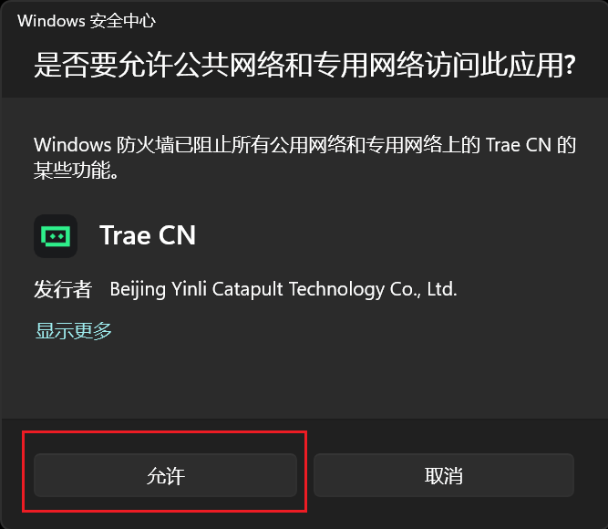

   - **Mac**：打开下载好的 `.dmg` 文件，拖拽到应用程序文件夹
     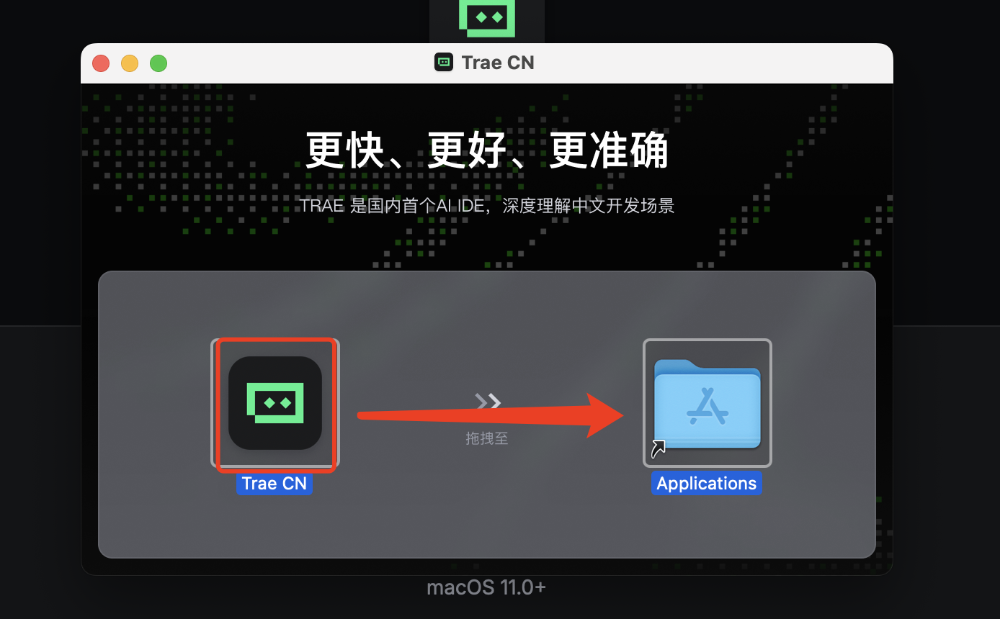
     看到这个进度则说明正在安装中
     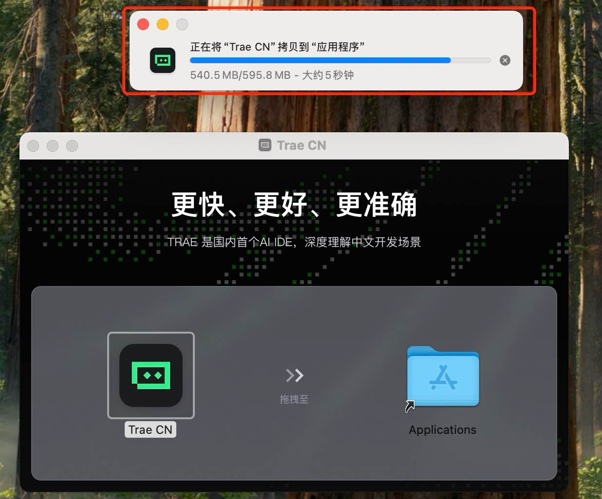
     安装成功后，我们就可以在桌面上找到 Trae 了！打开 Trae 完成后续设置
     

### ⚙️ 首次启动配置

1. **打开 Trae**

首次打开会有欢迎界面，点击**开始**进入下一步
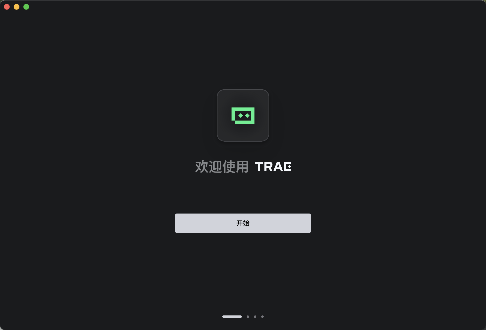

选择语言和使用的主题后，点击**继续**
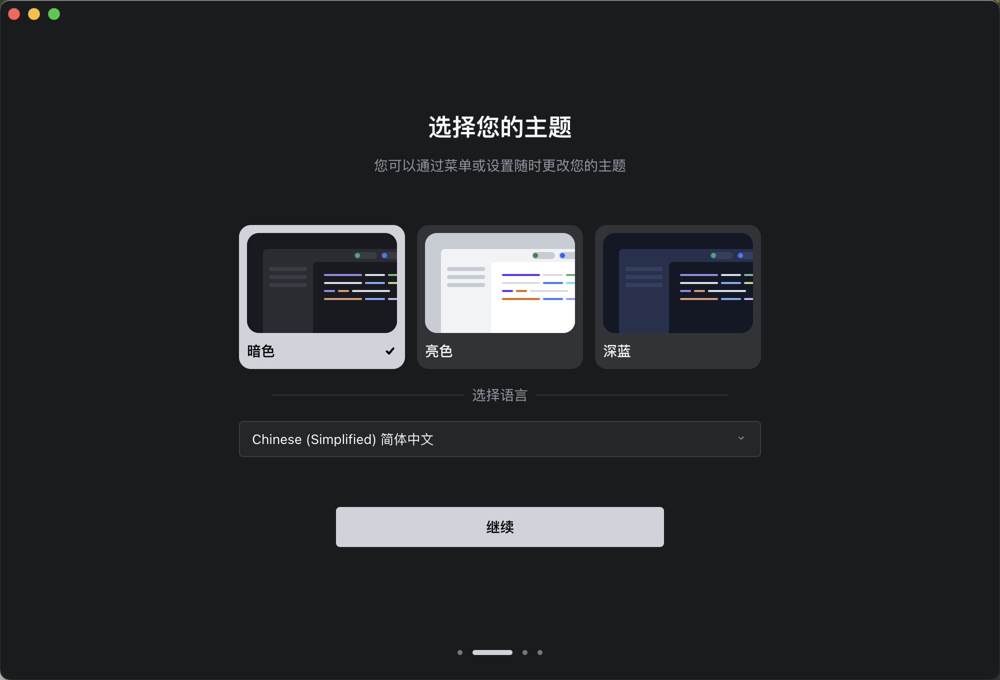

点击**安装 trae 命令**，这里涉及到通过命令行运行 Trae，至于什么是命令行，接下来的一节会告诉你。


点击**登陆**注册并登陆账号，会跳转到浏览器账号注册页面
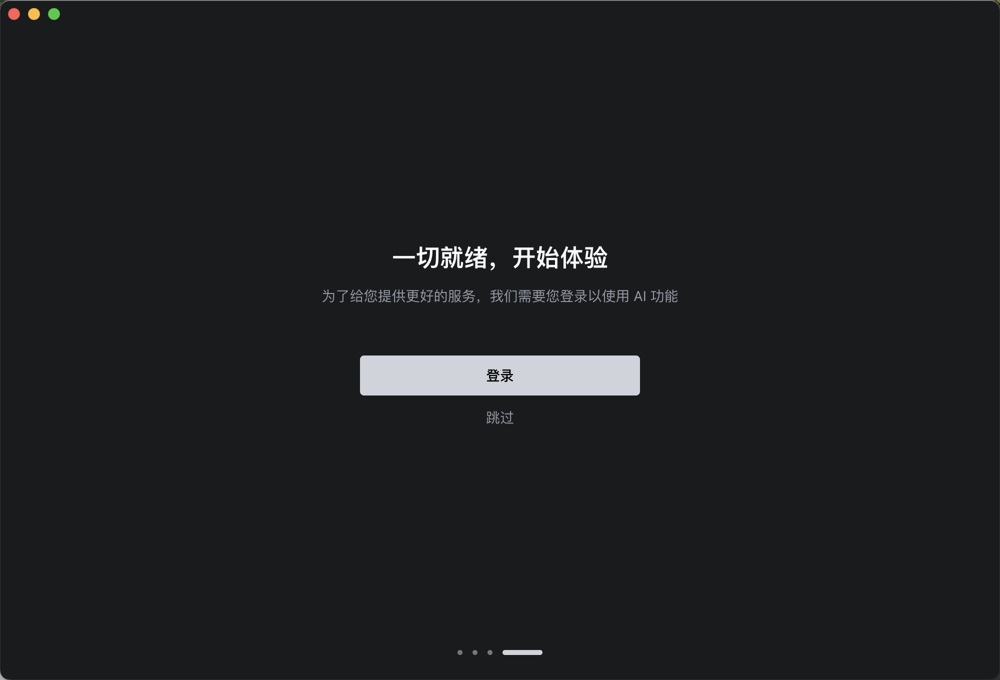

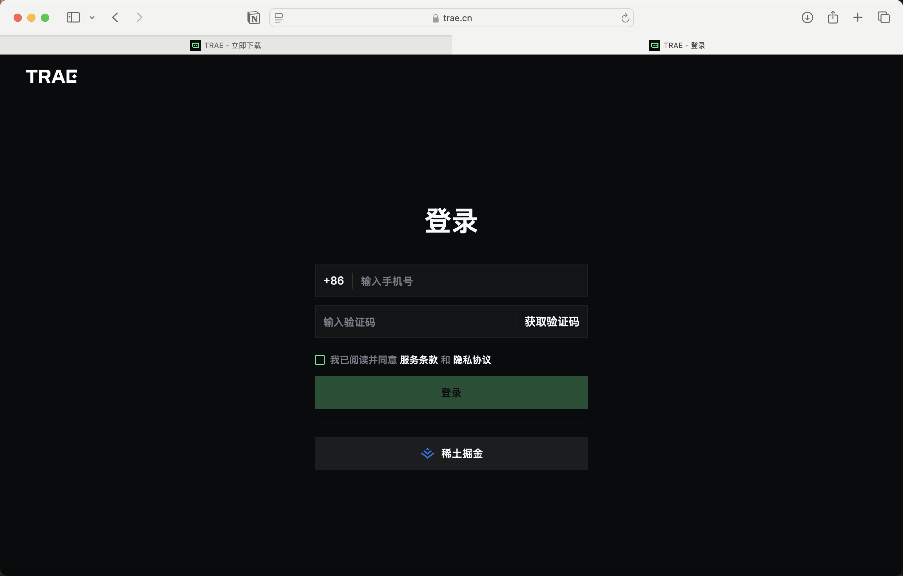

点击**登陆并打开 Trae**，即可进入到 Trae 的界面

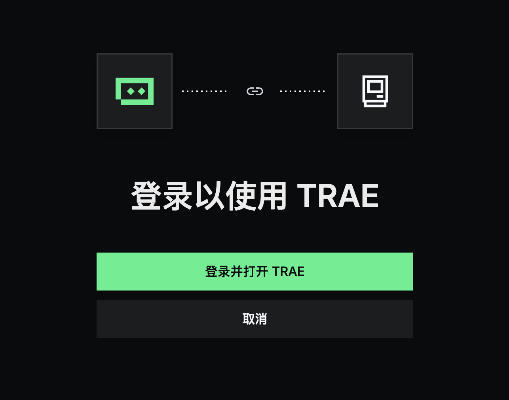

当你看到这个界面的时候，所有的配置都已经完成
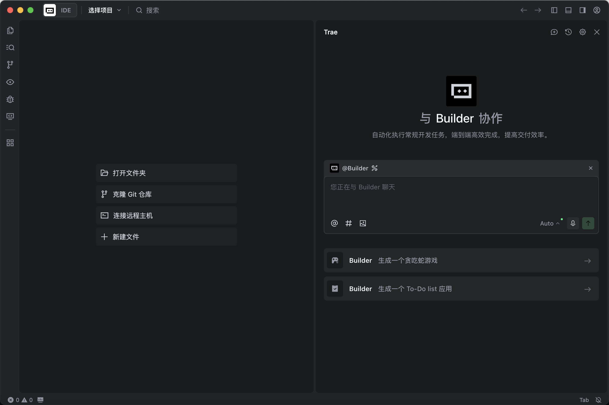

## 第一个程序：Hello World

看到这你可能会问，这和我第一章要构思搭建的程序有什么关系呀？

诶，"Hello World"对于程序员来说，就像是婴儿说出的第一句"妈妈"一样意义重大。

它是每个程序员学习新编程语言时写的第一个程序，虽然功能极其简单（只是让电脑在屏幕上显示"Hello World"这几个字），但它代表着一个重要的仪式：你成功地让计算机听懂了你的指令并做出了回应，这个看似微不足道的成就，标志着你正式踏入了编程世界的大门，也验证了你的开发环境已经准备就绪，可以开始创造更复杂的程序了。

当然，我们既然有 Trae 的加持，因此我们的"Hello World"程序，与程序员创建的第一个程序相比会更豪华一些。

现在，让我们一起创建第一个程序！这就像做菜前先学会煮个鸡蛋一样，虽然简单，但能让你快速熟悉整个流程。

### 🚀 Step 1：创建新项目

**创建新项目**就像是准备盖房子时先圈出一块地、搭建工地围栏一样——它是在电脑上创建一个**专门的文件夹**，用来存放你即将编写的所有代码文件、图片、配置等资源，相当于给你的程序准备了一个独立的"家"；这个过程通常会自动生成一些必要的基础文件（就像房子的地基），设置好**项目的名称**、**编程语言**、版本等基本信息，让你可以在这个干净、有条理的环境里开始写代码，而不是把文件散落得到处都是，同时也方便以后**管理**、**分享**或者**和其他人一起协作开发**。整个过程包括以下步骤：

1. 打开 Trae

2. 点击 "打开文件夹"
   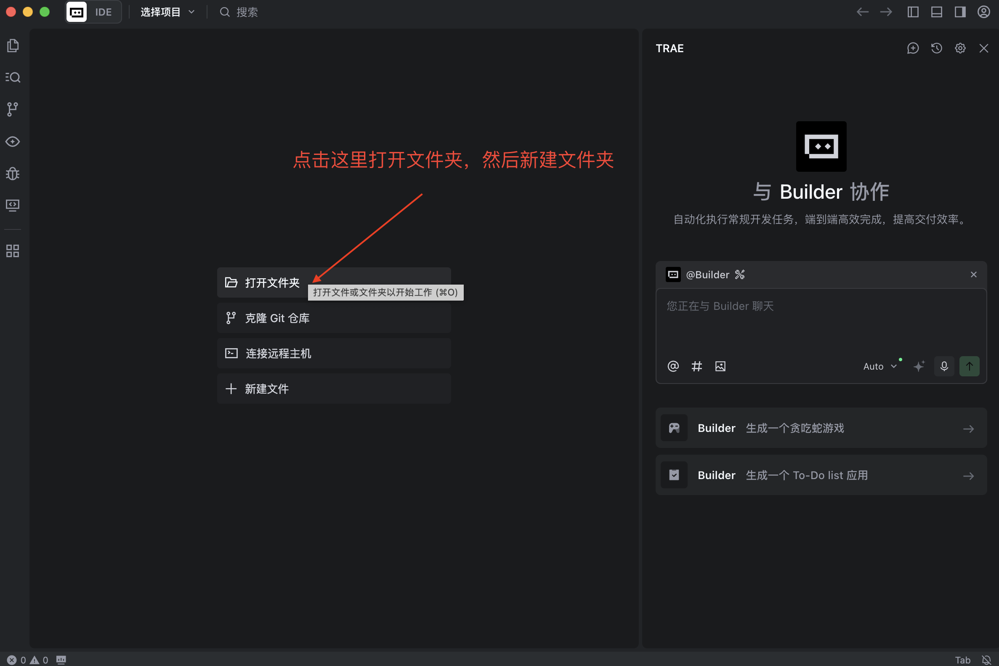

3. 在你想要创建项目的位置，**新建文件夹创建一个空文件夹**，并命名为 `my-first-app`
   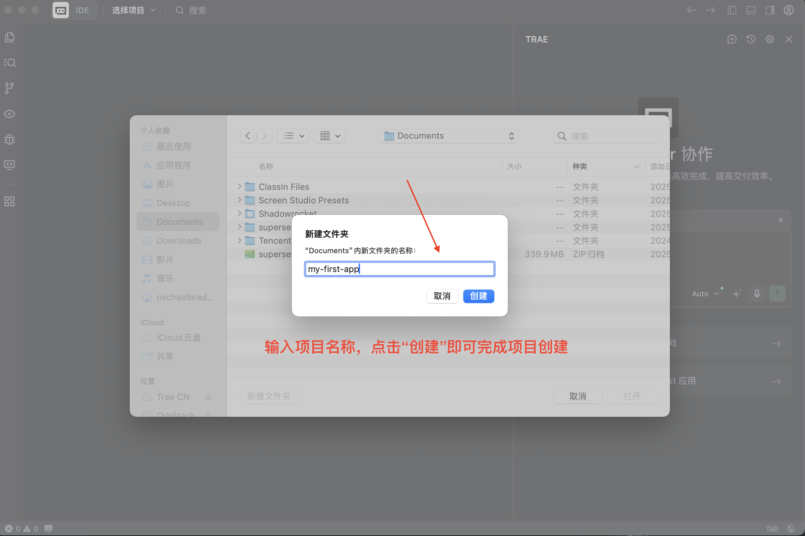

4. 此时，Trae 会自动将这个文件夹作为项目打开，如果跳出**是否信任此文件夹中的文件的作者**，点击**是，我信任此作者**（废话，不信的话就没办法写程序了呀），到这里，创建项目就完成了，创建项目的流程都是这个样子的。

   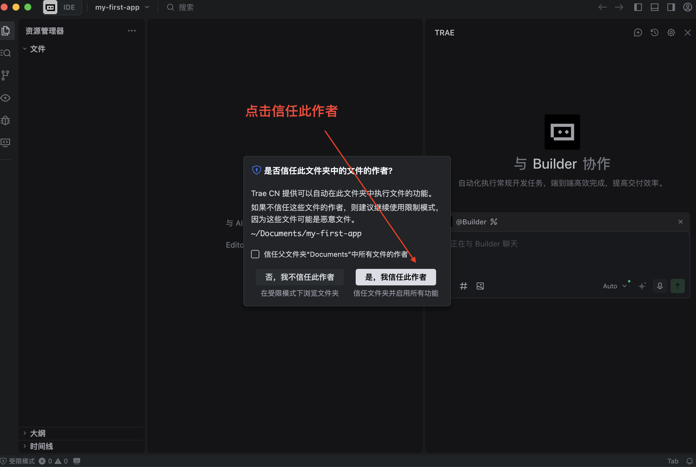

### 🎨 Step 2：和 AI 对话，生成第一个页面

这个时候，你的项目里一个文件都没有。

对于大家而言，激动人心的时刻来了，这是最有趣的部分！你可以直接用自然语言告诉 AI 你想要什么。接下来你就可以看到你的项目里填充的文件了。

1. **打开 AI 对话框**，在 Trae 界面的右侧与 Builder 协作

2. **描述你的需求**，这里以第一章开发心理健康助手的场景为例，在对话框中输入：

```markdown
## 提示词：创建心理健康助手网页

帮我创建一个心理健康助手的单页面网站，要求如下：

### 基本要求

- 创建三个文件，一个 HTML 文件，一个 CSS 文件和一个 JavaScript 文件

- HTML 文件中引入 CSS 文件和 JavaScript 文件

- 不需要后端，所有功能都在前端实现

- 界面要有呼吸感和灵动效果，整体美观舒适

### 页面结构

1. **顶部区域**：

- 网站标题："心灵守护者 - 您的情绪陪伴助手"

- 副标题："在这里，每一份情绪都值得被倾听"

2. **主聊天区域**：

- 左侧或上方显示聊天历史记录

- 底部有输入框，让用户输入他们的感受或问题

- 发送按钮要明显且友好

3. **预设快速选项**：

- 提供几个常见情绪按钮，如："感到焦虑"、"心情低落"、"压力很大"、"想倾诉"

- 点击后自动在输入框填入相关文字

### 视觉设计

- **配色方案**：使用柔和的色调，如淡紫色、浅蓝色、米白色等治愈系颜色

- **动画效果**：

- 背景要有缓慢的渐变动画，模拟呼吸的节奏

- 消息出现时要有淡入效果

- 输入框获得焦点时有轻微的发光效果

- 按钮悬停时有温柔的放大效果

### 模拟回复功能

请预设至少 10 条心理咨询师风格的回复，根据用户输入的关键词匹配并显示。例如：

- 如果用户提到"焦虑"、"紧张"、"担心"等词，回复类似："我理解您现在感到焦虑，这是很正常的情绪反应。让我们一起做个深呼吸练习，慢慢地吸气...保持...然后缓缓呼出..."

- 如果用户提到"累"、"疲惫"、"没力气"，回复类似："听起来您最近承受了很多压力，感到疲惫是身体在提醒我们需要休息了。您最近有好好照顾自己吗？"

- 如果用户提到"孤独"、"寂寞"、"没人理解"，回复类似："感到孤独是一种很深刻的情绪体验，我想让您知道，此刻我在这里陪伴着您，您并不是一个人..."

### 特殊功能

1. **呼吸练习引导**：

- 添加一个圆形的呼吸指示器

- 点击后开始 4-7-8 呼吸法动画引导

2. **情绪日记**：

- 用户可以记录当前的情绪状态（用 emoji 表情选择）

- 显示最近 7 天的情绪变化

3. **正念提醒**：

- 每隔一段时间，温柔地提醒用户关注当下

### 交互细节

- 助手回复要有打字机效果，一个字一个字地显示

- 用户发送消息后，显示"助手正在思考..."的温柔提示

- 所有的交互都要给人温暖、被理解的感觉

### 响应式设计

- 确保在手机、平板和电脑上都能完美显示

- 手机版本要特别优化输入体验
```

3. **AI 生成代码**

AI 会自动生成 HTML、CSS 和 JavaScript 代码，代码会出现在对应的文件中

你可以看到 Trae 创建了`index.html`（页面结构）、`style.css`（页面样式）、`script.js`（交互功能）三个文件。

创建好三个文件之后，点击**全部接受**，然后点击右下角的**停止**按钮结束本次对话。

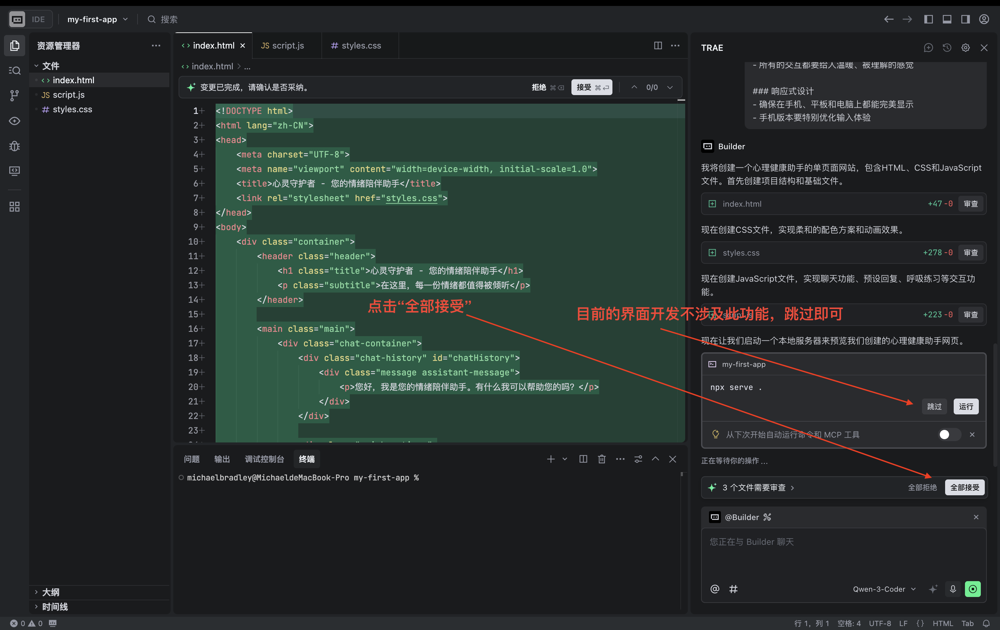

### 🎉 Step 3：理解生成的代码

到这里，恭喜大家成功入门**AI 前端开发**了！你在和 AI 对话的过程中，就是在向 AI 表明“我要绘制应用界面”，还记得“前端”是什么意思吗？接下来带大家理解这三个文件的含义。

1. **HTML 文件**：就像房子的骨架

   - `<h1>` 是大标题
   - `<p>` 是段落文字
   - `<button>` 是按钮
   - `<div>` 是容器，用来放其他元素

2. **CSS 文件**：就像房子的装修

   - 设置颜色、字体、大小
   - 创建渐变背景
   - 添加阴影和圆角效果

3. **JavaScript 文件**：就像房子的电路
   - 监听按钮点击事件
   - 获取当前时间并显示

聪明的你可能要问了：这都写完了，我该如何运行呢？

### 🎉 Step 4：运行代码

打开之前创建的`my-first-app`文件夹，找到`index.html`文件，双击打开。系统会自动调用**浏览器**运行你的代码。浏览器会自动打开一个新标签，并显示你的网页。


恭喜！你已经成功创建了一个简单的网页应用啦。

## AI 编程的最佳实践之一：提示词是门艺术

看到这里，可能有的学习者会问，**你的提示词**看起来好复杂，是你自己写的吗？

我的回答是，当然不是，是 Trae 自带提示词优化功能帮助我优化的。

看到这个小按钮了吗，哪怕你输入的提示词再简单，Trae 也会帮你优化成你想要的样子。

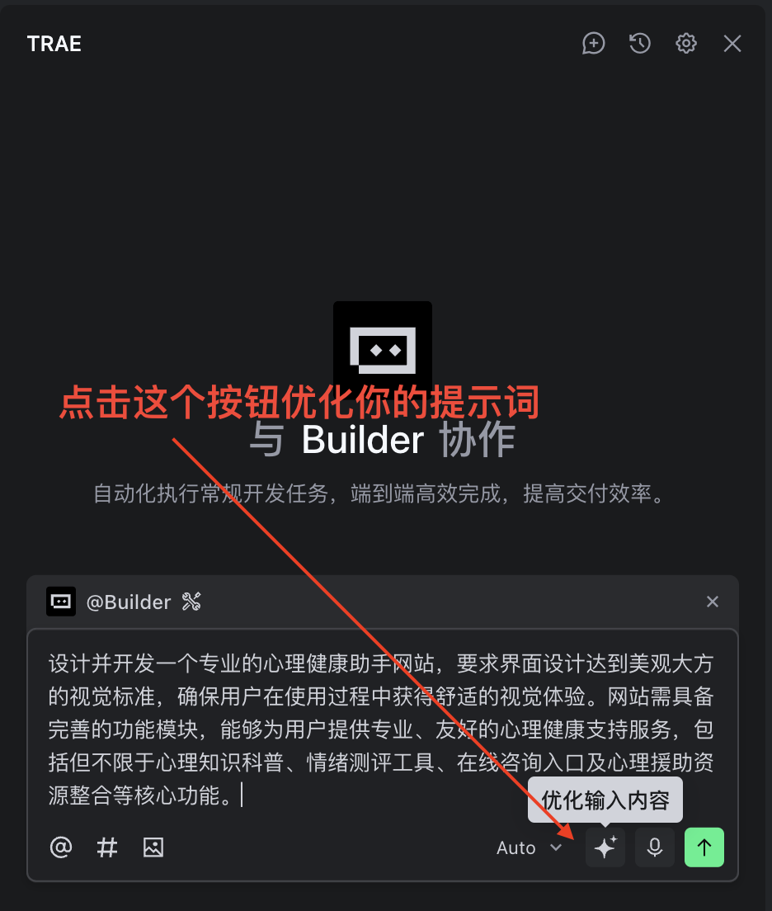

什么？简单的提示词也不知道怎么表达？

教你一招，**想象你在跟一个很聪明但没见过你项目的朋友解释**，你会怎么说？颜色要什么样的？布局怎么摆？有什么特殊功能？越具体越好。然后输入到 Trae 中，Trae 会自动给你优化。

还有的学习者可能会问，如果我想开发一个**提醒我运动的助手**，应该如何开始呢？

别急，我这里为大家准备好了一份**通用解决方案**，你只需要在我的提示词的基础上**填空（修改中括号里的内容）**就好：

```markdown
## 提示词：创建【助手类型】网页

帮我创建一个【助手名称】的单页面网站，要求如下：

### 基本要求

- 创建三个文件，一个 HTML 文件，一个 CSS 文件和一个 JavaScript 文件
- HTML 文件中引入 CSS 文件和 JavaScript 文件
- 不需要后端，所有功能都在前端实现
- 界面要【形容词 1】和【形容词 2】，整体【风格描述】

### 页面结构

1. **顶部区域**：

   - 网站标题："【主标题】"
   - 副标题："【副标题/口号】"

2. **主交互区域**：

   - 【布局位置】显示【交互内容】
   - 底部有输入框，让用户输入他们的【输入内容类型】
   - 【按钮名称】按钮要【按钮特点】

3. **预设快速选项**：
   - 提供几个常见【选项类型】按钮，如：【选项 1】、【选项 2】、【选项 3】、【选项 4】
   - 点击后自动在输入框填入相关文字

### 视觉设计

- **配色方案**：使用【色彩风格】的色调，如【颜色 1】、【颜色 2】、【颜色 3】等【风格形容】颜色
- **动画效果**：
  - 背景要有【动画类型】动画，【动画描述】
  - 【元素】出现时要有【效果类型】效果
  - 输入框获得焦点时有【焦点效果】效果
  - 按钮悬停时有【悬停效果】效果

### 模拟回复功能

请预设至少 10 条【角色风格】风格的回复，根据用户输入的关键词匹配并显示。例如：

- 如果用户提到【关键词组 1】等词，回复类似："【回复内容 1】"

- 如果用户提到【关键词组 2】，回复类似："【回复内容 2】"

- 如果用户提到【关键词组 3】，回复类似："【回复内容 3】"

[继续添加更多关键词和回复对...]

### 特殊功能

1. **【功能 1 名称】**：

   - 【功能 1 描述】
   - 【功能 1 交互方式】

2. **【功能 2 名称】**：

   - 【功能 2 描述】
   - 【功能 2 展示方式】

3. **【功能 3 名称】**：
   - 【功能 3 描述】
   - 【功能 3 触发方式】

### 交互细节

- 助手回复要有【效果类型】效果，【效果具体描述】
- 用户发送消息后，显示"【等待提示文字】"的【形容词】提示
- 所有的交互都要给人【感受 1】、【感受 2】的感觉

### 响应式设计

- 确保在手机、平板和电脑上都能完美显示
- 手机版本要特别优化【需要优化的体验】体验
```

## 下一步学习方向

恭喜你！你已经成功：
✅ 安装和配置了 Trae IDE
✅ 创建了第一个 Hello World 应用
✅ 学会了基本的 AI 编程对话
✅ 理解了前端代码的基本结构
✅ 掌握了简单的提示词优化方法

在接下来的章节中，我们将学习：

1. **终端和命令行基础**：学会用命令行管理项目
2. **理解项目结构**：深入了解文件和文件夹的组织
3. **调试和错误处理**：当出现问题时如何快速解决
4. **添加更多功能**：让你的应用变得更加实用

## 本章小结

在这一节中，我们学会了：

- **选择合适的工具**：AI 原生 IDE（如 Trae）比传统工具更适合初学者
- **安装和配置**：快速上手开发环境
- **AI 协作编程**：用自然语言描述需求，让 AI 生成代码
- **理解代码结构**：HTML、CSS、JavaScript 的基本作用
- **调试基础**：遇到问题时的基本解决思路

说点真心话，AI 编程确实降低了入门门槛。以前总觉得编程是天才们的游戏，现在发现其实每个人都能参与。你不需要记住编程语言的语法，不需要背诵文档（这又不是考试），你只需要清楚自己想要什么，剩下的 AI 会帮你搞定。

但这不意味着就不用学习了。**AI 是工具，真正的创意和想法还是要靠自己**。就像有了计算器，你还是得知道什么时候该加减乘除。

最后想说，如果你也在犹豫要不要开始学编程，别想太多，直接上手试试。下载个 Trae，跟 AI 聊聊天，做个小页面。你会发现，原来创造一个属于自己的数字作品，真的没那么难。谁知道呢，说不定下一个改变世界的应用，就是从你的"Hello World"开始的。

**准备好学习更多技能了吗？**

在下一节中，我们将学习如何使用终端（命令行），这是每个开发者都需要掌握的基本技能。别担心，我们会用最简单的方式带你入门！

---

## 思考题

1. 试着用 AI 修改你的 Hello World 页面，添加一个新功能（比如背景音乐、计算器、天气显示等）

2. 观察 AI 生成代码的过程，你觉得哪些部分是 HTML、CSS、JavaScript 分别负责的？

3. 如果你要向朋友介绍 AI 编程的优势，你会怎么说？

_完成这些思考题，会帮助你更好地理解 AI 编程的核心概念，为后续学习打下坚实基础。_
