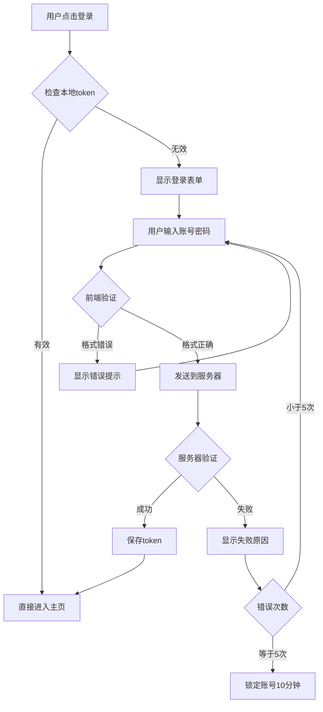
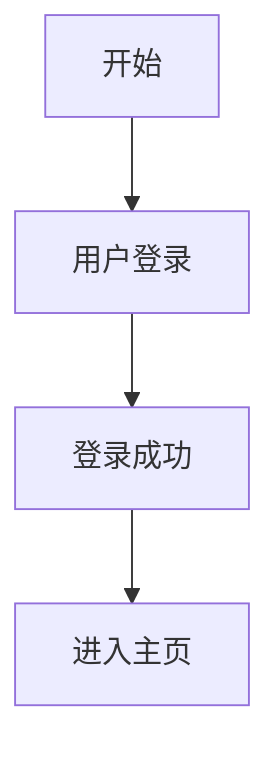
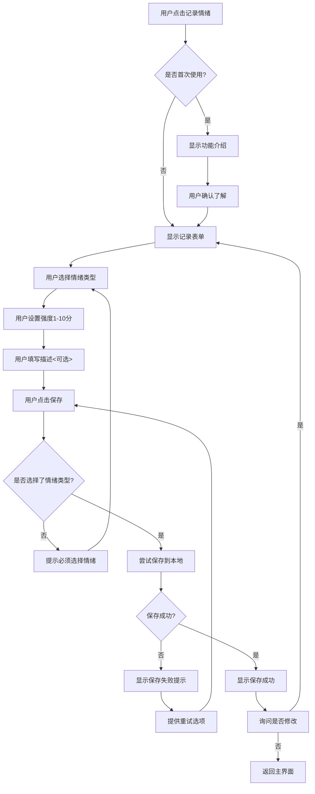

# 我都知道要做啥了，写什么用户故事啊这不废话嘛？

## 引言：一个新的困惑

在前两章中，我们解决了"为什么要学开发"和"如何与 AI 协作"的问题。现在你可能会想：

> "我已经想得很清楚了！我要做一个 AI 心理健康助手，有聊天功能，能记录情绪，还能给建议。这些我脑子里都有，为什么还要专门写什么用户故事？这不是多此一举吗？"

> "我知道我想要什么，直接让 AI 帮我做不就行了？为什么要搞这些看起来很官方的东西？"

说实话，刚开始做项目的时候，我也觉得写用户故事挺多余的。

明明脑子里已经想得很清楚了——做个 AI 心理健康助手，能聊天，能记录心情，就这么简单的事儿，为啥还要写一大堆看起来很正式的文档？

后来我才明白，这就像装修房子的差别。

## 一个熟悉的比喻：装修房子

让我们继续用生活中的例子来理解这个问题。

### 🏠 想法阶段：脑子里的完美房子

想象你要装修房子，脑子里已经有了清晰的画面：

- "我要一个温馨的客厅"
- "卧室要安静舒适"
- "厨房要实用方便"
- "整体风格要简约现代"

**这就像你现在的状态**：对想要做的 AI 助手有了基本概念。

### 🎯 用户故事阶段：具体的生活场景

但当你跟设计师说："我要个温馨的客厅，舒适的卧室。"

设计师会一脸懵："温馨是什么样的？你平时几个人住？朋友常来吗？看电视多还是看书多？"

这个时候你会发现，原来"温馨"这个词在每个人脑子里都不一样。

对我来说，温馨是能窝在沙发上看书的角落；对我朋友来说，温馨是一堆人聚在一起打游戏的大客厅。对你来说，“温馨”是什么呢？

**看出区别了吗？**

- **想法**：抽象、模糊、主观
- **用户故事**：具体、可执行、有明确目标

做 AI 助手也是这个道理。你说"聊天功能"，AI 可能理解成简单的一问一答；但你实际想要的，可能是一个能记住你们之前所有对话、懂你情绪起伏、半夜三更也能陪你说话的知心朋友。

## 脑子里的想法 vs 用户故事的差异

再举一个例子，我们每个人日常生活都会用到微信支付宝支付，我之前想做个记账应用，觉得特简单——记录收支，显示余额，完事儿。结果做出来才发现问题一大堆：

- 每天的消费记录很多，外卖是按照食品支出算还是按照购物支出算（微信账本这一点没有解决）。分类怎么设计？
- 退款和付款对应存在，用户想修改之前的记录怎么办？
- 要不要加预算功能？
- 多币种怎么处理？
- 万一换手机换电脑，数据丢了怎么办？

这些问题，如果一开始写用户故事的时候就会暴露出来。比如："作为一个经常出国的自由职业者，我希望能同时记录多种货币的收支，并能看到实时汇率换算后的总资产。"这么一写，需求立马就清晰了。

## 用户故事的魔力在哪儿

### 作用 1：帮你发现盲点

当你开始写用户故事时，你会发现很多之前没想到的问题：

**原始想法**："做一个情绪记录的功能"

最开始你可能就想着：让用户选个表情，写两句话，存起来。但开始写用户故事，问题就冒出来了：

**写用户故事时你会想到**：

- 深夜情绪崩溃的时候，用户真的有心情写长篇大论吗？
- 如果用户后悔了，想删掉某条记录怎么办？
- 用户会不会想看自己这个月比上个月是不是好转了？

这些细节，不写用户故事还真想不到。

### 作用 2：让 AI 更懂你

还是回到装修这件事。跟 AI 协作就像跟装修师傅沟通。

你说"做个书架"，师傅可能做个普通的格子架。

但如果你说"我有 300 本书，大部分是 32 开的小说，偶尔有几本画册，希望能按照作者分类摆放"，那做出来的东西肯定更合你心意。

同样道理，你跟 AI 说"做个聊天功能"，和说"作为一个深夜容易胡思乱想的人，我希望 AI 能像朋友一样陪我聊天，记得我之前说过的烦恼，不要每次都问'你怎么了'"，效果天差地别。

**没有用户故事的指令**：
"帮我做一个聊天功能"

**有用户故事的指令**：

```
基于以下用户故事，帮我设计聊天功能：

作为一个深夜容易胡思乱想的人，我希望 AI 能像朋友一样陪我聊天，记得我之前说过的烦恼，不要每次都问'你怎么了'
```

**区别很明显**：后者给出了具体的使用场景、功能要求和预期效果。

### 作用 3：避免功能蠕变

这个特别重要！没有用户故事的时候，特别容易陷入"功能狂魔"模式。今天觉得应该加个语音，明天觉得要不要做个视频通话，后天又想着是不是该有个社区功能...

**什么是功能蠕变？**
就是在开发过程中不断加新功能，最后项目变得臃肿复杂，永远做不完。

**没有用户故事时**：
"嗯，聊天功能做好了，要不再加个语音功能？"
"语音做好了，要不再加个视频？"
"视频做好了，要不再加个群聊？"

结果呢？啥都有，啥都不精，最后累个半死还没做出真正有用的东西。

**有用户故事时**：
但如果你一开始就写好用户故事，每次想加新功能就问自己：这符合我定义的核心用户需求吗？
不符合？那就忍住别加。

## 如何写出好用的用户故事

格式很简单，就是回答三个问题：

**WHO（谁）** - 不要说"用户"，要具体。是焦虑的大学生？失眠的程序员？还是产后抑郁的妈妈？

**WHAT（什么）** - 不是"聊天"这么笼统，而是"在凌晨三点焦虑发作时能立刻获得情绪疏导"

**WHY（为什么）** - 这个最容易被忽略，但超级重要。是为了"不吵醒家人"？还是"记录焦虑规律找到根源"？

### 用户故事的标准格式

```
作为一个 [具体的用户角色]，
我希望能够 [具体的功能]，
这样我可以 [达成的目标/获得的价值]。
```

我来举个例子，从垃圾版到优质版的进化：

垃圾版：
"用户想要记录心情。"

普通版：
"作为用户，我想记录每天的心情，这样能了解自己。"

优质版：
"作为一个正在服用抗抑郁药物的患者，我希望每天能快速记录情绪分值（1-10 分）和用药情况，这样在下次复诊时可以给医生看我的情绪变化曲线，帮助调整用药方案。"

看出差别了吗？最后这个版本，连开发的时候要做什么功能都一清二楚了。

### 实战练习：为 AI 心理健康助手写用户故事

让我们一起为心理健康助手写几个用户故事：

#### 故事 1：情绪记录功能

**基础版（不够好）**：
"作为用户，我希望能记录情绪，这样就能知道自己的情绪变化。"

**改进版（更好）**：
"作为一个情绪波动较大的大学生，我希望能够在每天睡前用 1-2 分钟快速记录今天的情绪状态和主要事件，这样我可以逐渐了解哪些事情容易影响我的心情，并学会提前应对。"

#### 故事 2：AI 对话功能

**基础版（不够好）**：
"作为用户，我希望能和 AI 聊天，这样能获得帮助。"

**改进版（更好）**：
"作为一个深夜经常感到孤独和焦虑的人，我希望能够随时与 AI 进行深入的心理对话，AI 能够记住我们之前的谈话内容，给出连贯性的建议，这样我在情绪低落时能够得到及时的支持和陪伴。"

#### 故事 3：数据隐私功能

**基础版（不够好）**：
"作为用户，我希望数据安全，这样比较放心。"

**改进版（更好）**：
"作为一个非常注重隐私的人，我希望我的所有心理健康数据都只存储在我自己的设备上，并且我可以随时完全删除这些数据，这样我可以毫无顾虑地分享我最深层的想法和感受。"

## 用户故事的进阶技巧

### 技巧 1：加入具体的使用场景

**普通写法**：
"作为焦虑患者，我希望能记录情绪。"

**场景化写法**：
"作为一个在考试前容易焦虑的学生，我希望能在感到紧张时立即打开应用记录当时的焦虑程度和想法，这样我可以在考试季结束后回顾这些记录，总结出有效的缓解方法。"

### 技巧 2：加入情感层面的需求

**功能导向**：
"我希望能看到情绪统计图表。"

**情感导向**：
"我希望能看到自己情绪逐渐好转的可视化图表，这样在低潮期时能够提醒自己'我正在进步'，获得继续坚持的动力。"

### 技巧 3：考虑边界情况

除了主要功能，还要考虑特殊情况：

"作为一个在情绪极度低落时可能想要删除所有记录的用户，我希望系统能够温和地询问我是否确定删除，并提供'暂时隐藏'的选项，这样我在冷静后还能重新查看这些对我康复有帮助的历史记录。"

## 一些容易踩的坑

### 误区 1：写成了功能清单

好多人写着写着就变成了：

登录功能
聊天功能
统计功能

这不是用户故事，这是功能列表。记住，永远要从"作为一个..."开始。

### 误区 2：过于技术化

**❌ 错误示例**：
"作为用户，我希望系统使用 256 位加密算法。"

用户才不关心你用什么算法呢！他们只想要"我的隐私不被泄露"。

**✅ 正确示例**：
"作为一个使用多个设备的用户，我希望能在手机和电脑上无缝切换使用，不需要重复登录。"

### 误区 3：缺乏具体性

**❌ 错误示例**：
"作为用户，我想要更好的体验。"

什么叫更好？是响应更快？界面更美？还是功能更强？得说清楚。

**✅ 正确示例**：
"作为一个不知道如何表达情感的人，我希望 AI 能够通过提问引导我说出内心的真实想法。"

## 把用户故事转化为开发任务

写完用户故事，下一步就是把它们变成开发任务。这个过程其实挺有意思的。

### 从用户故事到功能模块

**用户故事**：
"作为一个经常忘记吃药的抑郁症患者，我希望在该吃药的时间收到温柔的提醒，这样能保证治疗的连续性。"

**转化为开发任务**：

1. 做个用药记录功能
2. 加个定时提醒
3. 设计温暖不刺耳的提醒文案
4. 考虑用户可能的作息变化

### 优先级排序

当然，不是所有故事都要马上实现。我的建议是分三步走：

**第一步（MVP）**：先做最核心的，比如基本的情绪记录和简单对话
**第二步**：加点锦上添花的，比如数据分析图表
**第三步**：做些高级功能，比如个性化 AI 训练

## 实战练习：写出你的用户故事

现在轮到你了！请为我们的 AI 心理健康助手写出 3-5 个用户故事。

### 练习模板

```
用户故事1：情绪记录
作为一个 _________，
我希望能够 _________，
这样我可以 _________。

用户故事2：AI对话
作为一个 _________，
我希望能够 _________，
这样我可以 _________。

用户故事3：数据管理
作为一个 _________，
我希望能够 _________，
这样我可以 _________。

（可以继续添加更多故事）
```

### 我的示例答案

```
用户故事1：快速情绪记录
作为一个生活节奏很快的上班族，
我希望能够在30秒内完成当天的情绪记录（通过滑动条选择心情指数+可选的简短文字描述），
这样我可以在不影响日常工作的情况下坚持每天记录，逐渐了解自己的情绪模式。

用户故事2：深夜情感倾诉
作为一个经常在深夜感到孤独和焦虑的人，
我希望能够随时向AI倾诉我的烦恼，AI能够耐心倾听并给出温暖的回应，
这样我在无法入睡的夜晚能够获得情感上的陪伴和支持。

用户故事3：隐私保护
作为一个非常重视心理隐私的人，
我希望我的所有对话和情绪数据都只存储在我自己的设备上，并且可以随时彻底删除，
这样我可以放心地分享最真实的内心世界，不担心被他人获取或滥用。

用户故事4：情绪模式发现
作为一个想要提高情绪管理能力的人，
我希望能够看到我的情绪变化规律（比如哪些日子情绪较低，什么事件容易触发负面情绪），
这样我可以提前识别情绪风险，并采取预防措施。

用户故事5：个性化建议
作为一个希望获得针对性帮助的用户，
我希望AI能够基于我的历史记录和当前状态提供个性化的情绪调节建议，
这样我可以获得真正适合我的解决方案，而不是千篇一律的通用建议。
```

## 本章小结

用户故事真不是废话。它就像是你和 AI 之间的翻译器，把你脑子里那些模模糊糊的想法，翻译成清清楚楚的需求。

更重要的是，它逼着你站在用户角度思考。不是"我觉得这个功能很酷"，而是"这个功能真的能解决用户的问题吗"。

这个**从"我知道要做什么"到"我知道要为谁做什么以及为什么要做"的**思维转变，可能比学会任何技术都重要。因为最牛的产品，从来不是功能最多的，而是最懂用户的。

所以，别嫌麻烦，坐下来好好写几个用户故事。相信我，未来的你会感谢现在认真写故事的自己。

在下一章中，我们将学习如何把这些用户故事转化为可视化的流程图，让开发思路更加清晰。

---

## 思考题

1. 回顾你最初对 AI 心理健康助手的想法，写出 3 个具体的用户故事
2. 对比你的用户故事和我的示例，找出可以改进的地方
3. 想象你是目标用户，这些用户故事是否真的解决了你的痛点？

_完成这些练习后，你就掌握了将想法转化为需求的核心技能！_


# 脑子里画面超清晰，为啥还要画什么流程图啊？

## 引言：又一个常见的困惑

完成了前面三章的学习，你已经掌握了 AI 协作技能，也写出了清晰的用户故事。现在你可能会想：

> "我已经把用户故事写得很详细了，脑子里对整个应用的流程超级清楚，每个步骤我都想得明明白白的，为什么还要花时间画什么流程图？直接开始做不就行了？"

> "画流程图看起来好麻烦，而且我又不是产品经理，我就是想做个简单的应用，有必要搞得这么正式吗？"

我自己就经常遇到这种情况。脑子里明明想得特别清楚，整个应用怎么运行、用户怎么操作，每个细节都在脑海里过了好几遍。

可一旦真正动手做起来，就发现事情没那么简单了。

## 一个比喻：找路

想象你要给朋友指路去一个地方。你脑子里路线特清楚："出门右转，走到红绿灯左拐，看到星巴克再右转就到了。" 听起来很简单对吧？

但如果朋友问你：

- "要是那个红绿灯在修路怎么办？"
- "星巴克关门了我怎么认？"
- "右转之后走多远？"
- "路上有停车场吗？"

你突然发现，原来"清楚"的路线其实有好多细节没考虑到。

流程图就像是一份详细的地图，不仅标出主路，还标明了所有岔路口、可能的障碍、备选方案。有了它，不管遇到什么情况都能应对。

## 脑子里想的 vs 实际开发的差距

我给你看个特别实际的例子。就拿**用户登录**这个看似简单的功能来说：

你脑子里想的：用户输入账号密码 → 点登录 → 进入系统

实际开发时会遇到的问题（因为你永远都不知道使用者输入了什么）：

- 用户输入了邮箱还是手机号？
- 密码输错了显示什么提示？
- 连续输错 5 次要不要锁定？
- 登录中网络突然断了咋办？
- 登录成功后跳转到哪个页面？
- 下次打开要不要自动登录？
- 忘记密码的按钮放哪里？

突然间，一个"简单"的登录功能变成了十几个需要决策的点。如果没有流程图，你就得边写边想，写一半发现逻辑不对又得推倒重来。

## 流程图最大的价值：让 AI 准确理解你

这是我觉得最重要的一点。当你跟 AI 说"帮我做个登录功能"时，AI 可能会给你一个最基础的版本。但如果你给 AI 一个流程图：



AI 立刻就能理解你要的是什么，包括自动登录、错误处理、防暴力破解等所有细节。这样生成的代码质量会高很多。

看到这里你可能会问，你这是一堆代码啊，这不是图啊。别急，打开[这个链接](https://mermaid-live.nodejs.cn/edit#pako:eNplkF9v0lAYxr9Kc64ZKWW00AsTB_s_77yycNGMAou0XWob_7Qkw8RZFqFTIQ7BANkwRMfABDMdc_synNP2W1h6OuJiL5rz9P29z_P06GBXzgqABbmi_Hy3wCsq8TiVlgjvecjZ9QEyL-3Xv-Hbqd2cwj-NDLG09IBY0dHpAer0Ufsctseq_FSQSnhnZT43ULuCGqZBJDm7NUG1vnPbgm_6s19Tt_czcw_81PXBFIdObuyzKxzi9Aaw2gjAlJ-4GnRxbj56Ts7kK7Qu4ejQ7pYDbNXH1nRYqdrfR-63d86oHHRaw1Hda3htufWmMxoZxHoQiDWyjr1z5n8cDU_t3oVBbHDQeu8elKE5Ru0qPOrB5iDA13E_LDZ8sakvoHtFNrGzeQyPOgaxxc1uv8DhiX99mX8JePbDmfQNYjsoiTWsdWCrG4BbflASi21f7OjBz5z3UGMcRO5gw7E1u6rFvIlx1xQP7GFlMXjEufUyvPiMLzdCQvPQ_dDJgBDIK3tZwKqKJoSAKCgiP5dAnxulgVoQRCENWO-YFXK8VlTTIC2VvLV9Xnoiy-LdpiJr-QJgc3zxmae0_SyvCqk9Pq_w4uKrIkhZQUnKmqQClln2PQCrgxeAjZKJME1GojRJk7EERUZD4CVgqXiYpuJkJEZTETqxzETpUgi88lPJcIKkGIph4t7bg-Klv725RsM)就能看到原图了。

看完了你可能还会问，这个图是你自己画的？当然不是，是用 AI 自动生成的。要想讲透这一点，涉及到 mermaid 语法。

## 什么是 Mermaid 语法？

在学习如何画流程图之前，我们需要了解一个神奇的工具——**Mermaid**。

### Mermaid 简介

**Mermaid**是一种用文本描述图表的标记语言，就像用文字"画"图一样。你只需要写几行简单的代码，就能自动生成漂亮的流程图、时序图、甘特图等。

### 为什么选择 Mermaid？

1. **AI 友好**：AI 可以直接生成 Mermaid 代码，无需手工绘制（这个是最主要的原因，后面会告诉大家如何画这种流程图）
2. **代码化**：可以复制、修改、版本控制
3. **渲染美观**：自动生成专业的流程图样式

**举个简单例子**：

你写这样的文字：

```
flowchart TD
    A[开始] --> B[用户登录]
    B --> C[登录成功]
    C --> D[进入主页]
```

就能自动生成这样的流程图：



### 为什么选择 Mermaid？

**对比传统绘图方式**：

| 传统方式                   | Mermaid 方式                 |
| -------------------------- | ---------------------------- |
| 需要学习复杂的绘图软件     | 只需要写简单的文字代码       |
| 修改图表很麻烦，要重新拖拽 | 改几个字就能更新图表         |
| 难以与他人协作和分享       | 可以复制粘贴，版本控制       |
| AI 不容易理解和生成        | AI 可以直接生成 Mermaid 代码 |
| 图表样式需要手动调整       | 自动生成统一美观的样式       |

### 如何查看 Mermaid 流程图？

当你看到或写出 Mermaid 代码后，需要用专门的工具来查看实际的图表效果。

**推荐使用在线工具**：
🔗 **https://mermaid-live.nodejs.cn/edit**

**使用方法**：

1. 打开上面的链接
2. 在左侧编辑器中粘贴你的 Mermaid 代码
3. 右侧会实时显示生成的流程图
4. 可以导出为 PNG、SVG 等格式

**快速体验**：
复制下面的代码到在线编辑器试试：

```
flowchart TD
    A[我有一个想法] --> B[写用户故事]
    B --> C[画流程图]
    C --> D[开始开发]
    D --> E[成功上线]
```

你会看到一个完整的产品开发流程图！

**重要提示**：在后面的学习中，每当你看到

```mermaid
...代码...
```

这样的代码块时，都可以复制到 https://mermaid-live.nodejs.cn/edit 查看实际效果！

## 如何让 AI 帮你画流程图：先写后画

掌握了基础语法后，你就可以让 AI 成为你的流程图绘制助手了！

### 基础的 AI 画图指令

**标准模板**：

```
请用Mermaid语法画一个[功能名称]的流程图，包含以下步骤：
1. [步骤1]
2. [步骤2]
3. [步骤3]
...

需要考虑的异常情况：
- [异常1]
- [异常2]

请确保流程图包含开始和结束节点，以及所有的判断分支。
```

### 实战示例：让 AI 画情绪记录流程图

**你的指令**：

```
请用Mermaid语法画一个"用户记录每日情绪"的流程图，包含以下步骤：

主要流程：
1. 用户点击"记录情绪"按钮
2. 显示情绪记录表单
3. 用户选择情绪类型（开心/难过/焦虑/平静）
4. 用户设置情绪强度（1-10分）
5. 用户可选填写情绪描述
6. 用户点击保存
7. 保存到本地存储
8. 显示保存成功提示

需要考虑的异常情况：
- 用户首次使用，需要功能说明
- 用户未选择情绪类型就点保存
- 本地存储失败
- 用户想要修改刚保存的记录

请确保流程图清晰易懂，包含所有判断节点和错误处理路径。
```

**AI 可能的回复**：



[效果预览](https://mermaid-live.nodejs.cn/edit#pako:eNpVkdlu2kAUhl_FmmtANma1qlQNZN-rXtVwYQUDkVgi16gLIFWNQmgpggtoqRJSkVKatqkhUqU2uOCX8Xh5i5rxEOG5mjP6zvn_808RHOYTPGBAMpN_fpjmBJF4Eo3lCOs8YvXWtVb9o7-5g2eyIY3gpK2dnOryjzjhdi8Ry0WtM4TNgTn4oN301Ili4Q_Ldu8yIkoWUCIirNaZ6v0xfPfZOJmock2X63EHZg0pEVGM2UJG7xrW2xiLIGxl7qcnGVJfHVeMb18wsIIA7DuKilVMm6_farXvtm_9VoaXNdyzirA1jBnSVJ9I8N8YjgeUmyJhtYK5NcStYw72fsLKJ63RMJTRA9gYWuOXMLiOwA1HaqrShb86GNhAwOY8NmTMWmPR2zy_zYVgtlit0Zzlp5yaPXlxn7gDRmFvs3DUNYZtWxhWR9rFDbwYYXLLjsYutlGxU7RRrdq0Pmiuv7Ogv4s_Bo_s3xq_v9qO4g4Y6e85YHsoxnYRtj_bRp2em2d1y6a1jdm7w8AeAg5YY3hlfpTslFRF0lpzYN9O2C4OFlSjjifk-jFrKC14fqn-lfX2e7N7FQcukBKOEoARhQLvAlleyHKzEhRn3TEgpvksHwOMdU3wSa6QEWMglitbbcdc7mk-n513CvlCKg2YJJd5ZlWF4wQn8tEjLiVw2ftXgc8leCGSL-REwPhICg0BTBG8AAxFBTxBOuD10n6aDJOhEO0CLwHjD3oCQZr0--lgKBQIk2Ff2QVeIV2vxxcO034vRfsoyuvzBcr_AR3VqXU)

### AI 画图的最佳实践

1. **先描述再画图**：详细描述需求，让 AI 充分理解
2. **分层次画图**：先画主流程，再添加细节
3. **多轮迭代**：不断优化和完善
4. **验证逻辑**：让 AI 检查流程的完整性
5. **保存模板**：把好用的提示词保存下来重复使用

## 流程图工具推荐

当然，除了 mermaid 之外，还有其他工具也能够画流程图。

- **draw.io**：免费，功能强大
- **ProcessOn**：中文界面，简单易用

## 本章小结

我知道画流程图感觉像是在"浪费时间"，特别是当你急着想看到成果的时候。但相信我，这个时间投资绝对值得。就像磨刀不误砍柴工，花 1 小时画流程图，能帮你节省 10 小时的返工时间。

而且你不需要画得多专业，哪怕是在纸上画个草图，或者用最简单的方块和箭头，只要能把逻辑理清楚就行。重点不是图画得多漂亮，而是把脑子里模糊的想法变成清晰的步骤。

试试看吧，就从你最想做的那个功能开始，花 20 分钟画个简单的流程图。我保证，你会发现很多之前没想到的细节，而这些细节恰恰决定了你的应用是"能用"还是"好用"。

**从"我想得很清楚"到"我画得很清楚"，这是从想法到产品的关键一步。**

在下一章中，我们将正式进入"筑基期"，开始学习前端、后端、数据库等基础概念，并用 AI 创建我们的第一个 MVP。

---

## 思考题

1. 尝试为"用户查看情绪历史"功能画一个完整的流程图
2. 对比你的流程图和我的示例，找出可以改进的地方
3. 想象你要向一个从未用过手机的人解释如何使用微信，你会怎么画流程图？

_完成这些练习后，你就掌握了将需求转化为可视化设计的核心技能！_

现在，"练气期"的四个基础章节全部完成。你已经掌握了：

- ✅ 为什么要学开发（动机建立）
- ✅ 如何与 AI 协作（工具掌握）
- ✅ 如何写用户故事（需求分析）
- ✅ 如何画流程图（逻辑设计）

准备好进入"筑基期"，开始真正的动手实践了吗？
