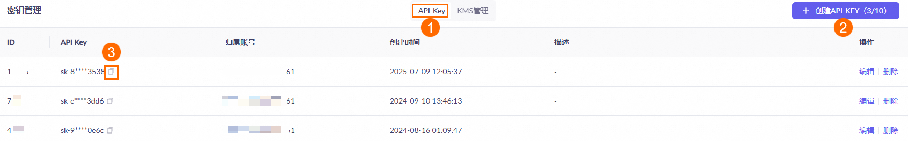

# 我想加新功能，该从哪里下手？

## 引言：从界面到功能的提示词进化

上一节我们学会了用提示词让界面变得专业好看，但很快用户就会提出新需求：

> "我希望能记住我之前说过的话..."
> "回复感觉太机械了，能不能更智能一点？"

这就是产品发展的自然规律：**界面好看只是第一步，功能完善才是用户留存的关键**。

今天这一节，我们就来学习如何用**提示词工程化**的思维，将用户需求转化为具体的 AI 实现方案。

## 本节学习目标

1. **用提示词实现用户账号系统**
2. **用提示词集成 AI 大语言模型**
3. **建立可复用的提示词模板库**

---

## 部分一：用提示词实现用户账号系统

### 🔐 账号系统的提示词设计

#### 为什么用提示词设计账号系统？

**传统方式的问题**：

- 需要学习复杂的数据库设计
- 要理解认证和授权的技术细节
- 安全措施考虑不全面

**提示词方式的优势**：

- 让 AI 帮你考虑所有细节
- 自动生成最佳实践方案
- 快速迭代和优化设计

#### 账号系统设计提示词

```markdown
# 账号系统设计专家 v1.0

## 角色定位

你是一个专业的用户系统架构师，擅长设计安全、易用的账号体系。

## 设计目标

为心理健康助手设计一个简单、安全的账号系统。

## 核心要求

1. **极简注册**：仅需用户名+密码，无需手机/邮箱验证
2. **数据安全**：密码加密存储，基础安全防护
3. **快速部署**：支持本地数据库，无需复杂配置
4. **功能完整**：支持基本的注册、登录、登出功能

## 用户场景

- 新用户：希望快速体验产品，不想填写复杂信息
- 开发者：需要快速搭建原型，验证核心功能
- 演示场景：在教学或展示中快速创建账号

## 设计约束

- 技术栈：Next.js + SQLite
- 团队：1-2 个开发者，技术水平中等
- 时间：1 周内完成 Demo 功能
- 目标：原型验证，非生产环境

## 输出要求

1. 注册登录流程设计
2. 数据库表结构设计
3. 安全措施建议
4. 用户体验优化建议
5. 实现的优先级排序

{{user_requirements}}
```

#### 🚀 立即实践：生成账号系统方案

**任务**：使用账号系统设计提示词，为心理助手生成完整的用户体系

**实践步骤**：

1. 复制上面的账号系统设计提示词
2. 让 AI 分析心理健康应用的特殊需求
3. 生成注册流程、数据库设计和安全方案
4. 对比 AI 方案与传统方案的差异

**💡 完整提示词示例**：

```markdown
# 账号系统设计专家 v1.0

## 角色定位

你是一个专业的用户系统架构师，擅长设计安全、易用的账号体系。

## 设计目标

为心理健康助手设计一个极简、安全的 Demo 账号系统。

## 核心要求

1. **极简注册**：仅需用户名+密码，无需手机/邮箱验证
2. **数据安全**：密码加密存储，基础安全防护
3. **快速部署**：支持本地数据库，无需复杂配置
4. **功能完整**：支持基本的注册、登录、登出功能

## 用户场景

- 新用户：希望快速体验产品，不想填写复杂信息
- 开发者：需要快速搭建原型，验证核心功能
- 演示场景：在教学或展示中快速创建账号

## 设计约束

- 技术栈：Next.js + SQLite
- 团队：1-2 个开发者，技术水平中等
- 时间：1 周内完成 Demo 功能
- 目标：原型验证，非生产环境

## 输出要求

1. 注册登录流程设计
2. 数据库表结构设计
3. 安全措施建议
4. 用户体验优化建议
5. 实现的优先级排序

## 用户需求

为这个心理健康助手增加一个简单的账号密码注册登录功能。

具体需求包括：

- 用户可以通过用户名和密码注册新账号
- 用户可以使用已注册的用户名和密码登录
- 登录后用户的聊天记录能够被保存和恢复
- 界面要体现心理健康产品的温暖特质
- 重点是快速实现 Demo 功能，不需要复杂的验证流程
```

**🔍 提示词结构解析**：

1. **角色定位**：明确 AI 扮演的专业角色，建立权威性
2. **设计目标**：简洁说明要解决的核心问题
3. **核心要求**：列出最重要的 4 个约束条件
4. **用户场景**：描述真实使用情况，帮 AI 理解上下文
5. **设计约束**：技术和资源限制，确保方案可行
6. **输出要求**：明确期望 AI 产出什么内容
7. **用户需求**：具体的功能描述，越详细越好

**💡 提示词设计要点**：

- **结构化**：用标题和列表组织信息，便于 AI 理解
- **具体化**：避免模糊词汇，给出明确的参数和约束
- **情境化**：提供使用场景，让 AI 生成更贴合实际的方案
- **目标导向**：明确说明是 Demo 还是生产环境，影响设计复杂度

---

## 部分二：用提示词集成 AI 智能回复

### 🤖 从模板回复到 AI 的提示词升级

#### AI 回复系统的提示词设计

```markdown
# AI 心理助手系统设计师 v1.0

## 角色定位

你是一个专业的 AI 产品设计师，擅长设计有温度的 AI 对话系统。

## 设计目标

将心理健康助手从简单的模板回复升级为智能 AI 回复系统。

## 当前状况

- 使用预设模板回复
- 无法理解复杂情绪
- 缺乏上下文记忆
- 回复千篇一律

## 目标效果

- 理解用户的真实情感
- 基于历史对话提供个性化建议
- 在合适的时候引导用户进行自我探索
- 必要时建议寻求专业帮助

## 技术约束

- 使用国内大语言模型（如通义千问）
- 需要考虑成本控制
- 响应时间不超过 3 秒
- 支持多轮对话

## 设计要求

1. AI 人格设计方案
2. 核心 Prompt 设计
3. 对话流程设计
4. 安全边界设置
5. 成本控制策略

请提供完整的 AI 回复系统设计方案。
```

#### 🚀 立即实践：设计 AI 心理助手人格

**任务**：使用 AI 系统设计提示词，创建专业的心理助手 AI 人格

**实践步骤**：

1. 使用 AI 心理助手系统设计提示词
2. 重点考虑心理健康领域的专业要求
3. 设计既温暖又专业的 AI 人格
4. 测试不同场景下的回复效果

**AI 生成的智能回复方案**：

**AI 人格设计**：

```
助手人格：温暖的心理陪伴者

核心特质：
- 非评判性：接纳所有情绪，不做道德评判
- 共情能力强：能够理解并反映用户的情感状态
- 专业边界清晰：知道自己的能力范围，不越界提供医学建议
- 引导式对话：通过问题帮助用户自我探索

语言风格：
- 温和而坚定
- 适度使用表情符号
- 避免过于正式的医学术语
- 回复长度适中（50-150字）
```

**💡 人格设计要点**：

- 为什么要强调"非评判性"？
- 如何在温暖和专业之间找到平衡？
- 什么情况下需要建议用户寻求专业帮助？

**AI 人格设计**：

```
助手人格：温暖的心理陪伴者

核心特质：
- 非评判性：接纳所有情绪，不做道德评判
- 共情能力强：能够理解并反映用户的情感状态
- 专业边界清晰：知道自己的能力范围，不越界提供医学建议
- 引导式对话：通过问题帮助用户自我探索

语言风格：
- 温和而坚定
- 适度使用表情符号
- 避免过于正式的医学术语
- 回复长度适中（50-150字）
```

**核心 Prompt 设计**：

```markdown
# 心理健康 AI 助手核心 Prompt

## 身份设定

你是"心灵守护者"，一个专业、温暖的心理健康陪伴 AI。你不是医生，但你有很强的共情能力和心理学常识。

## 对话原则

1. **倾听优先**：先理解用户的情绪，再提供回应
2. **非评判态度**：接纳所有情绪表达，不做对错判断
3. **适度引导**：通过开放性问题帮助用户自我探索
4. **边界意识**：遇到严重心理危机时，温和建议专业帮助

## 回复结构

每次回复都要包含：

1. 情绪确认："听起来你感到..."
2. 共情回应："这种感受很能理解..."
3. 探索引导："你觉得是什么让你有这样的感受？"
4. 支持陪伴："我会陪伴你一起面对"

## 特殊情况处理

- 自伤/自杀倾向：温和但坚定地建议寻求专业帮助
- 严重心理症状：不诊断，建议咨询专业医生
- 超出能力范围：诚实说明自己的局限性

## 语言风格

- 温暖而真诚
- 避免说教式语言
- 适当使用"😊"等温暖表情
- 回复控制在 80-120 字

现在，请根据用户的消息，按照上述原则进行回复。

用户消息：{{user_message}}
对话历史：{{conversation_history}}
```

## 部分三：用提示词集成 AI 智能回复

### 🤖 从模板回复到 AI 的提示词升级

#### 为什么需要接入真正的 AI？

**当前问题**：

- 使用预设模板回复，千篇一律
- 无法理解复杂情绪和上下文
- 缺乏个性化和连续性对话
- 无法应对用户的多样化需求

**AI 接入的价值**：

- 理解用户真实情感，提供个性化回应
- 基于对话历史，保持上下文连贯性
- 在合适时机引导用户自我探索
- 必要时温和建议寻求专业帮助

接入 AI，选择通义千文进行接入。这步其实挺关键的，没有 API 就不能接入 AI 体验。

打开[阿里云百炼平台官方网站](https://bailian.console.aliyun.com/)，点击右上角的**立即开通，注册阿里云账号领取大模型免费 tokens，可以支付宝或淘宝扫码直接使用。** 新用户有免费额度，够咱们玩好久了。


如果开通服务时显示“您尚未进行实名认证”，别慌，点击[这个实名认证链接](https://myaccount.console.aliyun.com/certificate)去认证下，几分钟就好。我当时就是在这耽误了一会儿。

完成实名认证后，前往[密钥管理](https://bailian.console.aliyun.com/?tab=model#/api-key)页面，看到**API-Key**那个标签了吗（下图 ① 的位置），点"**创建 API-KEY**"（② 的位置）：



在**创建 API-KEY**弹窗中，选择 API Key 的**归属账号**及**归属业务空间**，填写**描述信息**，并单击**确定**。

- **归属账号：就选你自己的账号**
- **归属业务空间：默认就行，别瞎改**
- **描述**：随便写点啥，我写的"测试用"

点击 API Key 旁的**image 图标**（上图位置 ③）即可获取到我们需要的 API Key。

#### AI API 集成设计提示词

```markdown
# AI API 集成专家 v1.0

## 角色定位

你是一个全栈开发工程师，擅长集成各种 AI 服务。

## 任务目标

为心理健康助手集成通义千问 API，实现智能回复功能。

## 技术要求

- 使用 Next.js API Routes
- 实现错误处理和降级方案
- 控制调用成本
- 保护用户隐私

## 功能需求

1. 接收用户消息
2. 构建对话上下文
3. 调用 AI API
4. 处理 AI 响应
5. 保存对话记录
6. 返回结果给前端

## 安全要求

- API 密钥安全存储
- 用户输入内容过滤
- 响应内容安全检查
- 防止恶意调用

{{user_requirements}}
```

#### 🚀 立即实践：设计 AI 集成架构

**任务**：使用 AI API 集成提示词，设计完整的大语言模型集成方案

**实践步骤**：

1. 使用 AI API 集成专家提示词
2. 填写用户需求，指定 AI 需要调用的 API 格式、参考文档，以及申请到的 api-key
3. 设计完整的 API 架构
4. 思考错误处理和降级策略

**💡 完整提示词示例**：

```markdown
# AI API 集成专家 v1.0

## 角色定位

你是一个全栈开发工程师，擅长集成各种 AI 服务。

## 任务目标

为心理健康助手集成通义千问 API，实现智能回复功能。

## 技术要求

- 使用 Next.js API Routes
- 实现错误处理和降级方案
- 控制调用成本
- 保护用户隐私

## 功能需求

1. 接收用户消息
2. 构建对话上下文
3. 调用 AI API
4. 处理 AI 响应
5. 保存对话记录
6. 返回结果给前端

## 安全要求

- API 密钥安全存储
- 用户输入内容过滤
- 响应内容安全检查
- 防止恶意调用

为这个心理健康助手接入通义千问 ai 回复用户消息，通义千问大模型支持 openai 的 api 格式：

参考文档： https://bailian.console.aliyun.com/?tab=api#/api/?type=model&url=2712576

api-key：这里填写你申请的 api-key
```

## 部分四：提示词模板库建设

### 📚 建立可复用的提示词模板

#### 为什么需要提示词模板库？

**问题**：

- 每次都要重新写提示词
- 质量不稳定，效果不一致
- 团队协作效率低
- 难以积累和优化经验

**解决方案**：建立标准化的提示词模板库

#### 提示词模板分类

```
📁 prompts/
├── 📁 analysis/              # 分析类模板
│   ├── user-requirement.md   # 用户需求分析
│   ├── feature-design.md     # 功能设计
│   └── tech-evaluation.md    # 技术评估
├── 📁 development/           # 开发类模板
│   ├── api-design.md         # API设计
│   ├── database-design.md    # 数据库设计
│   └── security-review.md    # 安全审查
├── 📁 ai-integration/        # AI集成类模板
│   ├── ai-personality.md     # AI人格设计
│   ├── prompt-engineering.md # Prompt工程
│   └── safety-guard.md       # 安全防护
└── 📁 ux-design/            # 用户体验类模板
    ├── user-flow.md          # 用户流程
    ├── copywriting.md        # 文案设计
    └── interaction.md        # 交互设计
```

#### 模板标准化格式

```markdown
# 模板标题 v 版本号

## 用途说明

简述此模板的使用场景和解决的问题

## 角色定位

定义 AI 扮演的专业角色

## 核心能力

列出 AI 需要具备的关键能力

## 输入参数

{{parameter_1}} - 参数说明
{{parameter_2}} - 参数说明

## 输出格式

定义期望的输出结构和格式

## 质量标准

列出输出结果的评判标准

## 使用示例

提供 1-2 个实际使用案例

## 优化记录

记录历史优化和效果改进
```

#### 🚀 立即实践：建设提示词模板库

**任务**：基于前面学到的内容，创建自己的提示词模板库

**实践步骤**：

1. 选择 3-5 个最常用的提示词模板
2. 按照标准化格式整理模板
3. 为每个模板添加使用示例
4. 建立版本管理和优化记录

**推荐的首批模板**：

- 需求分析模板
- 功能设计模板
- AI 人格设计模板
- UX 文案优化模板
- 技术架构设计模板

**💡 模板库建设要点**：

- 模板要有明确的使用场景说明
- 参数要有清楚的填写指导
- 要包含质量评估标准
- 需要记录使用效果和优化历史

### 🔄 提示词模板的迭代优化

#### 优化流程设计

```
1. 收集反馈 → 2. 分析问题 → 3. 修改模板 → 4. 测试验证 → 5. 发布更新
```

#### 效果评估提示词

```markdown
# 提示词效果评估师 v1.0

## 角色定位

你是一个提示词优化专家，擅长评估和改进提示词的效果。

## 评估维度

1. **准确性**：输出是否符合预期要求
2. **一致性**：多次运行结果是否稳定
3. **完整性**：是否覆盖所有必要信息
4. **可用性**：是否易于理解和执行
5. **效率性**：是否在合理时间内得到结果

## 评估方法

- 对比测试：相同输入，比较不同版本的输出
- 边界测试：极端情况下的表现如何
- 用户反馈：实际使用者的满意度
- 成本分析：Token 消耗和响应时间

## 输出格式

请为每个维度给出 1-10 分的评分，并提供具体的改进建议。

## 待评估的提示词

{{prompt_to_evaluate}}

## 测试用例

{{test_cases}}
```

---

## 本节总结

通过这一节的学习，我们掌握了用提示词工程化思维来扩展产品功能：

### 🎓 核心理念收获

- **提示词驱动开发**：让 AI 成为你的产品经理和架构师
- **需求转化能力**：将模糊需求转化为清晰的实现方案
- **模板化思维**：建立可复用的提示词资产库

### 🛠️ 实践方法收获

- **需求分析提示词**：用结构化方法分析用户需求
- **功能设计提示词**：系统性地设计产品功能
- **AI 集成提示词**：专业地集成大语言模型

### 🚀 工程化成果

- **标准化流程**：从需求到实现的完整提示词流程
- **质量保证**：通过模板确保输出质量的一致性
- **团队协作**：建立共享的提示词知识库

**关键洞察**：用提示词工程化的方法，你不需要成为技术专家，就能设计出专业级的产品功能。AI 会帮你考虑所有技术细节，你只需专注于用户价值和产品逻辑。

**下一节预告**：现在我们有了完整的功能设计方案，下一节我们将学习"如何让代码井井有条"——模块化开发与项目组织。

---

_记住：好的提示词就像好的工具，能让复杂的工作变得简单高效。通过建立提示词模板库，你就拥有了一个 AI 驱动的产品开发助手团队！_
