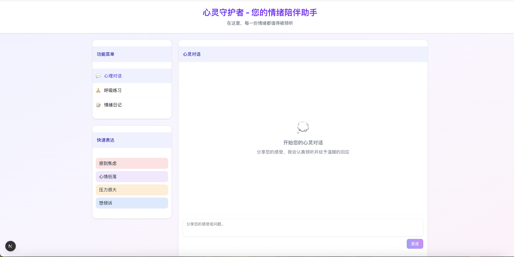
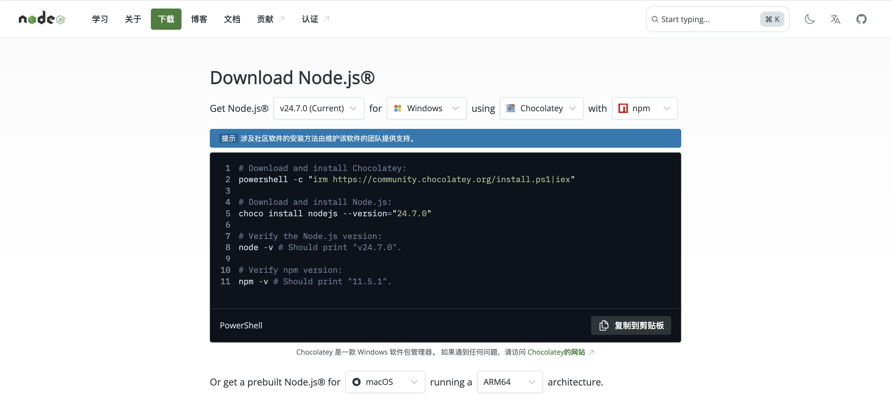
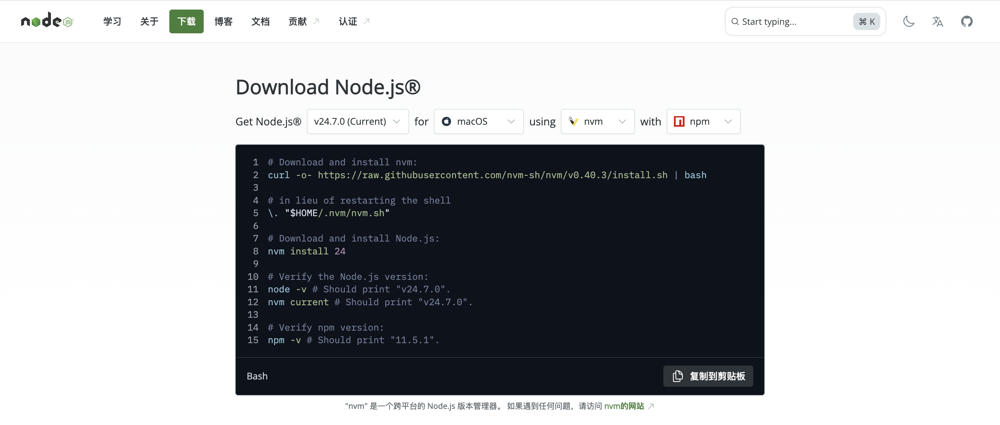

# 界面太丑了，如何设计界面？

## 引言：从原生控件到现代化组件

说实话，第二章做出来的心理健康助手虽然能用，但界面真的是...一言难尽。就像穿着十年前的衣服去参加聚会，功能是没问题，但总觉得哪里不对劲。

我记得第一次给朋友看我做的网页时，他直接问我："这是...2010 年的网站吗？"那一刻我才意识到，在 2025 年，用户对界面的期待已经完全不同了。

这样的界面在 2010 年也许还说得过去，但在 2025 年，用户期待的是这样的体验：

- 🎨 **现代化设计**：圆角、阴影、渐变
- 🎬 **流畅动画**：按钮悬停效果、页面切换动画
- 📱 **响应式布局**：手机电脑都好看
- 🚀 **交互反馈**：加载状态、成功提示
- 🎯 **一致性设计**：所有组件风格统一

大家现在打开任何一个 App，都能看到精心设计的圆角、柔和的阴影、流畅的动画。

如果我们的产品还是方方正正的按钮配上系统默认字体，用户第一反应可能就是"这东西靠谱吗？"

今天这一节，简单来说，就是让你的网页从"能用"升级到"想用"。我会带你了解现在最流行的前端技术栈，然后重点是——怎么用 AI 快速生成漂亮的界面，而不是自己带着 AI 从零开始写 CSS 写到头秃。

## 本节学习目标

1. **理解现代化 UI 技术栈**
2. **掌握 Next.js + Tailwind CSS + shadcn/ui 组合**
3. **学会使用 Framer Motion 添加动画**
4. **通过 AI 快速生成现代化界面**

---

## 部分一：为什么原生控件不够用？

### 🤔 原生控件的局限性

让我们诚实地面对一个事实：用原生 HTML 控件写出来的界面，往往会让人觉得"很程序员"。

#### 问题 1：视觉效果差

我们在上网的时候经常会遇到过一些可以点击的**按钮**，实际上，**最原生的按钮**在代码里长这个样子：

```html
<button>Submit</button>
```

另外，我们经常会登陆自己的账号和密码，这种登陆界面，在前端设计领域通常叫“表单”。**最原生的表单**在代码里长这个样子：

```html
<form>
  <input type="email" placeholder="Email" />
  <input type="password" placeholder="Password" />
  <button type="submit">Login</button>
</form>
```

浏览器渲染出来就是一个灰不拉几的方块，点击时还有那种 90 年代的凹陷效果。而现在用户习惯的是什么？Material Design 那种有涟漪效果的按钮，或者 Apple 风格的毛玻璃效果。差距不是一点半点。

我曾经试图用纯 CSS 美化一个表单，写了快 200 行代码，结果在不同浏览器上显示效果还不一样。Safari 上看着还行，Chrome 上就变形了，更别提 IE 了（还好现在没多少人用 IE 了）。

#### 问题 2：维护成本高

你的项目小的时候还好，等你有了十几个页面，每个页面都有自己的样式文件，想统一改个按钮颜色？祝你好运，慢慢找吧。

我有个朋友的项目，CSS 文件加起来有 3000 多行，他说每次改样式都像在玩扫雷，不知道会炸到哪里。

**问题总结**：

- 🎨 **美观度不足**：2025 年的用户期待更高
- 🔄 **代码重复**：每个组件都要重新写样式
- 🐛 **维护困难**：修改一个样式要改很多地方
- 📱 **响应式复杂**：适配移动端需要大量媒体查询
- ⏰ **开发效率低**：从零开始写每个组件

### 💡 现代化解决方案

现在的前端开发，我们有了更好的选择：

```
🏗️ 构建基础: Next.js
     ↓
🎨 样式基础: Tailwind CSS
     ↓
🧩 组件库: shadcn/ui
     ↓
🎬 动画增强: Framer Motion
```

### 🏗️ Next.js：让你的网页瞬间变专业的神器

#### 什么是 Next.js？

**简单来说**：Next.js 就是一个"网页美化器" + "超级加速器"。

**用生活中的例子来理解**：

想象你要开一家咖啡店：

**传统方式**（就像第二章我们做的）：

- 你需要自己找店面、装修、买设备、培训员工
- 每一步都要亲力亲为，很容易出问题
- 开业时间长，效果还不一定好

**用 Next.js**（就像用连锁品牌的成熟方案）：

- 店面设计、装修风格、设备配置都有现成的最佳方案
- 你只需要专注于"卖什么咖啡"、"怎么服务客人"
- 快速开业，而且一开业就是专业水准

#### Next.js 到底能让我们做什么？

**1. 瞬间让网页变好看**

第二章效果：😅

用 Next.js 后：✨



**2. 自动适配所有设备**

- **在电脑上**：大屏幕，信息展示更丰富
- **在手机上**：自动调整布局，操作更方便
- **在平板上**：完美的中间状态

**3. 让网页速度飞快**

- 页面打开比第二章快 3-5 倍
- 切换页面像本地应用一样流畅
- 图片自动优化，加载更快

**4. 添加专业级功能**

```
第二章只能做到：
✅ 发送消息
✅ 显示回复

用 Next.js 可以轻松实现：
✅ 用户登录记住你
✅ 保存聊天历史
✅ 个性化推荐
✅ 数据分析图表
✅ 微信分享功能
✅ 搜索引擎收录
```

**总结**：Next.js 不是让编程变复杂，而是让做出专业产品变简单。有了 AI 助手，你可以专注于"我想要什么效果"，而不用担心"怎么实现"！

### 🎨 Tailwind CSS：原子化样式框架

#### 什么是 Tailwind CSS？

Tailwind CSS 是一个"原子化"的 CSS 框架。简单说就是把 CSS 拆分成很多小的"原子"，你可以像搭积木一样组合它们。

以前

**传统 CSS 写法要给按钮加样式，得先想个类名，然后去 CSS 文件里写一堆属性。**：

```css
.my-button {
  background-color: #3b82f6;
  color: white;
  padding: 8px 16px;
  border-radius: 4px;
  border: none;
  cursor: pointer;
}
```

**Tailwind CSS 则直接以语义化的方式写出来**：

```html
<button
  class="bg-blue-500 text-white px-4 py-2 rounded border-none cursor-pointer"
>
  Click me
</button>
```

看起来类名很长，但其实每个都有明确的含义。bg-blue-500 是蓝色背景，px-4 是左右 padding，rounded 是圆角。写熟了之后效率贼高。

### 🧩 shadcn/ui：高质量组件库

#### 什么是 shadcn/ui？

shadcn/ui 不是传统意义上的"组件库"，而是一套**可复制粘贴的组件代码**。

**使用传统组件库**，你调用之后就是个黑盒，你不能完全控制组件的样式，打包体积大而且定制化困难。

**shadcn/ui 是把组件代码直接复制到你项目里**，比方说，你需要一个对话框组件：

```bash
npx shadcn-ui@latest add dialog
```

输入这个命令会在你的项目里创建一个`Dialog.tsx`文件，里面是完整的组件代码。想改样式？直接改。想加功能？随便加。完全在你的掌控之下。

### 🎬 Framer Motion：专业动画库

#### 为什么需要动画？

好的动画不是为了炫技，而是为了：

- **引导用户注意力**：重要操作有动画反馈
- **提供状态反馈**：让用户知道操作是否成功
- **增强沉浸感**：流畅的界面让人愉悦
- **减少感知延迟**：适当的动画让等待不那么无聊

#### Framer Motion 简介

Framer Motion 是 React 生态中最强大的动画库，使用简单但功能强大。

动画这东西，适量就是画龙点睛，过度就是画蛇添足。Framer Motion 让添加动画变得特别简单：

```typescript
<motion.div initial={{ opacity: 0, y: 20 }} animate={{ opacity: 1, y: 0 }}>
  我会从下面淡入
</motion.div>
```

几行代码就能实现专业的动画效果。用户体验一下子就上去了。

当然，上面“现代化的解决方案”，都绕不开 nodejs 环境，后续的步骤都会涉及到 nodejs 环境。那么如何安装呢？

其实很简单，打开，会根据你当前的系统，推荐安装涉及到的命令，直接把命令复制到终端中执行，就可以使用了。

Windows 系统把上面的命令复制到 powershell 中执行即可。



macOS 系统把上面的命令复制到 terminal 中执行即可。



## 部分二：如何用"人话"描述现代化界面？

这是很多人忽略的技能——怎么用"人话"告诉 AI 你想要什么样的界面。我们从用户的思维和程序员的思维两个角度来分析一下。

### 🎯 用户期待 vs 程序员思维

很多程序员（包括刚入门的我们）容易陷入"功能实现就够了"的思维陷阱。但 2025 年的用户期待是这样的：

**用户看到原生按钮的内心想法**：

> "这个网站是不是很久没更新了？"
> "看起来不太专业，能信任吗？"
> "界面这么丑，功能应该也不怎么样吧..."

**用户看到现代化界面的反应**：

> "哇，这个应用看起来很专业！"
> "界面很舒服，用起来应该不错"
> "这家公司应该很靠谱"

所以，界面不只是"好看"的问题，它直接影响用户对我们产品的信任度！

### 💡 什么样的界面算"现代化"？

不需要懂设计，我们先来看看现代化界面的"套路"：

#### 1. 卡片化布局

**传统方式**（看起来像表格）：

```
|  标题  |  内容  |  按钮  |
|  标题  |  内容  |  按钮  |
```

**现代化方式**（每个内容都是独立的卡片）：

```
┌─────────────┐  ┌─────────────┐
│   标题      │  │   标题      │
│   内容      │  │   内容      │
│   [按钮]    │  │   [按钮]    │
└─────────────┘  └─────────────┘
```

#### 2. 空白间距

- **密密麻麻**：内容挤在一起，看着累
- **适当留白**：给眼睛休息的空间，看着舒服

#### 3. 圆角设计

- **方方正正**：看起来死板
- **圆润边角**：看起来温和友好

#### 4. 颜色搭配

- **五颜六色**：像 90 年代的网站
- **统一色调**：2-3 种颜色为主，其他做辅助

#### 5. 交互反馈

- **点击没反应**：用户会疑惑"点击了吗？"
- **有动画反馈**：按钮变色、页面淡入等

### 🤔 如何描述这些需求？

这里就是关键了！我们不需要懂技术细节，但需要学会用"人话"描述我们想要什么样的效果。

#### 从"程序员语言"到"人话"

**❌ 程序员说法**：

```
"帮我实现一个具有现代化 UI 的登录组件，使用 Tailwind CSS 进行样式设计，集成 shadcn/ui 组件库，添加 Framer Motion 动画效果"
```

**✅ 人话版本**：

```
"我想要一个登录页面，要求：

视觉效果：

- 整体看起来干净简洁，不要花里胡哨
- 有一种现代化的感觉，像 iPhone 应用那样
- 背景用温和的渐变色，不要纯白色
- 登录框要有圆角和淡淡的阴影

交互体验：

- 输入框获得焦点时要有明显的提示
- 按钮点击时要有按下的感觉
- 整个页面打开时要有从下往上滑入的效果
- 登录成功后要有友好的提示消息

布局要求：

- 在手机和电脑上都要好看
- 登录框在屏幕中央
- 各个元素之间要有适当的间距
- 字体大小要合适，不要太小"
```

看出区别了吗？第二种描述方式：

- ✅ 不用技术术语
- ✅ 描述具体的视觉效果
- ✅ 说明用户的感受
- ✅ 给出参考（"像 iPhone 应用那样"）

### 🎨 实用的"人话"描述模板

#### 模板 1：描述视觉风格

```
我想要一个 [页面类型]，风格要求：

参考风格：像 [知名应用/网站] 那样的感觉
整体印象：[简洁/现代/温暖/专业/时尚] 的感觉
颜色倾向：[蓝色系/灰色系/暖色调/冷色调]
特别要求：[圆角/直角]、[有阴影/无阴影]、[渐变/纯色]
```

**实际例子**：

```
我想要一个个人简历页面，风格要求：

参考风格：像Apple官网那样简洁的感觉
整体印象：专业、干净、有设计感
颜色倾向：以白色和浅灰色为主，用蓝色做点缀
特别要求：圆角设计、有淡淡的阴影、背景用微妙的渐变
```

#### 模板 2：描述交互体验

```
用户操作体验：

按钮交互：点击时要有 [变色/缩放/阴影] 效果
页面切换：要有 [淡入淡出/滑动/缩放] 动画
状态提示：[成功/失败/加载中] 要有明确的视觉反馈
响应速度：动画要 [快速/自然/缓慢]，不要让人觉得卡顿
```

#### 模板 3：描述布局需求

```
页面布局：

整体结构：[左右分栏/上下分栏/卡片网格/单列布局]
重点突出：最重要的内容是 [xxx]，要放在显眼位置
内容组织：相关内容要 [分组显示/用卡片包装/用分割线区分]
适配要求：在 [手机/平板/电脑] 上都要清晰可用
```

### 🚀 进阶：学会"偷师"优秀设计

#### 方法 1：找参考

当你不知道怎么描述时，找个你觉得好看的网站作为参考：

```
"我想要一个仪表板页面，参考 [具体网站名称] 的设计风格：

相似之处：
- 卡片式的数据展示方式
- 左侧导航栏的设计
- 顶部搜索框的样式

不同之处：
- 我希望用蓝色而不是绿色作为主色调
- 图表要更简洁一些
- 添加一些微妙的动画效果"
```

#### 方法 2：描述感受

```
"我希望用户打开这个页面时的感受是：

第一印象：'哇，这个应用看起来很专业'
使用过程：'操作很流畅，很容易找到我要的功能'
整体感觉：'这个团队很用心，产品质量应该不错'"
```

#### 方法 3：对比说明

```
"我不想要：
- 像Excel表格那样密密麻麻的布局
- 像早期网站那样花里胡哨的装饰
- 点击没反应的死板交互

我想要：
- 像Pinterest那样的卡片式布局
- 像Apple产品那样的简洁风格
- 像微信那样的流畅交互"
```

## 部分三：实战：用提示词创建心理健康助手

### 🎯 从"让 AI 帮我做个心理助手"到专业提示词

让我们看看如何从一个简单的想法，一步步升级成专业的提示词，来创建我们的心理健康助手。

#### 第一版：初学者的提问

```
"帮我做个心理健康助手"
```

**AI 可能生成的结果**：一个非常基础的聊天界面，和你第二章做的差不多。

#### 第二版：添加视觉要求

```
"帮我做个心理健康助手，要求：
- 看起来温暖治愈一些
- 不要太死板
- 要有圆角和柔和的颜色
- 背景不要纯白色"
```

**改善**：已经比第一版好很多，但还是比较笼统。

#### 第三版：添加具体的描述

```
"帮我设计一个心理健康助手，要求：

视觉效果：
- 整体风格要温暖治愈，像冥想App那样安静
- 背景用淡紫色到白色的渐变，模拟呼吸的感觉
- 聊天框是白色卡片，有柔和的阴影和圆角
- 按钮和输入框都要有现代化的样式

交互体验：
- 输入框获得焦点时要有温柔的发光效果
- 按钮悬停时有轻微的放大效果
- 消息出现时要有淡入动画
- 整个页面要有缓慢的呼吸动画

功能需求：
- 预设情绪快捷按钮（焦虑、低落、压力等）
- 智能回复系统
- 呼吸练习指导
- 情绪记录功能

技术要求：
- 在手机和电脑上都要完美显示
- 使用现代化的前端技术
- 代码要清晰易懂"
```

**效果**：这样的提示词 AI 就能生成非常不错的现代化心理助手了！

#### 第四版：加入工程化提示词模板

现在，让我们创建一个专门用于心理健康助手的提示词模板：

```markdown
# 心理健康助手设计专家 v1.0

## 角色定位

你是一个专业的心理健康应用 UI/UX 设计师，擅长创造温暖、治愈、用户友好的心理支持界面。

## 设计原则

### 治愈系美学

- 使用温柔、安静的色彩（淡紫、浅蓝、米白等）
- 圆润的边角和柔和的阴影
- 适当的留白，营造宁静的氛围
- 避免尖锐的线条和刺眼的颜色

### 情感化交互

- 所有动画都要传达关怀和温暖
- 使用呼吸节奏的动画效果
- 交互反馈要温柔而明确
- 错误提示要包容和鼓励

### 技术实现

- 使用 Next.js + Tailwind CSS + shadcn/ui + Framer Motion
- 重点使用 Framer Motion 创建呼吸动画
- 确保无障碍访问友好
- 代码要简洁、易懂、易维护

## 输出要求

1. 提供完整组件代码
2. 包含详细的动画效果实现
3. 确保响应式设计适配所有设备
4. 提供情绪识别和回复逻辑
5. 包含呼吸练习等特殊功能

## 用户需求

{{user_requirements}}
```

### 🚀 使用新提示词模板

现在我们用这个模板来创建心理健康助手：

```markdown
@prompts/mental-health-designer.md

请帮我设计一个现代化的心理健康助手，要求：

### 页面结构

1. **顶部区域**：

- 网站标题："心灵守护者 - 您的情绪陪伴助手"

- 副标题："在这里，每一份情绪都值得被倾听"

2. **主聊天区域**：

- 左侧或上方显示聊天历史记录

- 底部有输入框，让用户输入他们的感受或问题

- 发送按钮要明显且友好

3. **预设快速选项**：

- 提供几个常见情绪按钮，如："感到焦虑"、"心情低落"、"压力很大"、"想倾诉"

- 点击后自动在输入框填入相关文字

### 视觉设计

- **配色方案**：使用柔和的色调，如淡紫色、浅蓝色、米白色等治愈系颜色

- **动画效果**：

- 背景要有缓慢的渐变动画，模拟呼吸的节奏

- 消息出现时要有淡入效果

- 输入框获得焦点时有轻微的发光效果

- 按钮悬停时有温柔的放大效果

### 模拟回复功能

请预设至少 10 条心理咨询师风格的回复，根据用户输入的关键词匹配并显示。例如：

- 如果用户提到"焦虑"、"紧张"、"担心"等词，回复类似："我理解您现在感到焦虑，这是很正常的情绪反应。让我们一起做个深呼吸练习，慢慢地吸气...保持...然后缓缓呼出..."

- 如果用户提到"累"、"疲惫"、"没力气"，回复类似："听起来您最近承受了很多压力，感到疲惫是身体在提醒我们需要休息了。您最近有好好照顾自己吗？"

- 如果用户提到"孤独"、"寂寞"、"没人理解"，回复类似："感到孤独是一种很深刻的情绪体验，我想让您知道，此刻我在这里陪伴着您，您并不是一个人..."

### 特殊功能

1. **呼吸练习引导**：

- 添加一个圆形的呼吸指示器

- 点击后开始 4-7-8 呼吸法动画引导

2. **情绪日记**：

- 用户可以记录当前的情绪状态（用 emoji 表情选择）

- 显示最近 7 天的情绪变化

3. **正念提醒**：

- 每隔一段时间，温柔地提醒用户关注当下

### 交互细节

- 助手回复要有打字机效果，一个字一个字地显示

- 用户发送消息后，显示"助手正在思考..."的温柔提示

- 所有的交互都要给人温暖、被理解的感觉

### 响应式设计

- 确保在手机、平板和电脑上都能完美显示

- 手机版本要特别优化输入体验
```

### 🎨 AI 生成的效果对比

**第二章的原生版本**：

- ❌ 基础的 HTML 表单
- ❌ 冷冰冰的系统样式
- ❌ 没有任何动画和温暖感
- ❌ 移动端体验差

**第三章的现代化版本**：

- ✅ 温暖的呼吸渐变背景
- ✅ 治愈系的卡片设计
- ✅ 流畅的情感化动画
- ✅ 智能的情绪识别
- ✅ 专业的心理支持回复
- ✅ 完美的移动端体验

**关键是**：我们没有学习复杂的心理学知识，但是通过更好的提示词就得到了专业级的心理健康助手！

### 👨‍🏫 实际操作步骤

1. **在项目中创建提示词文件**

   - 新建 `prompts/mental-health-designer.md`
   - 复制上面的专业模板

2. **使用提示词生成代码**

   - 在 AI 工具中引用：`@prompts/mental-health-designer.md`
   - 输入具体的心理助手需求

3. **迭代优化**

   - 测试生成的助手效果
   - 根据用户体验调整提示词
   - 重新生成直到达到治愈效果

4. **保存和分享**
   - 把有效的心理支持模板保存下来
   - 和同学分享温暖的设计经验

## 部分四：AI 助手让界面设计变得简单

### 🤖 用 AI 生成现代化界面

现在最棒的地方来了：你不需要成为设计师，也能创造出专业级的界面！

#### 提示词模板

让我们创建一个专门用于界面设计的工程化提示词：

```markdown
# 现代化 UI 设计助手 v1.0

## 角色定位

你是一个专业的 UI/UX 设计师，擅长使用 Next.js + Tailwind CSS + shadcn/ui + Framer Motion 技术栈创建现代化界面。

## 设计原则

### 视觉设计

- 使用现代化的设计语言（圆角、阴影、渐变）
- 保持一致的间距系统（Tailwind 的间距规范）
- 选择协调的色彩搭配（主要使用 blue/gray/slate 色系）
- 确保足够的对比度和可读性

### 交互设计

- 所有交互都要有视觉反馈
- 使用适当的动画增强体验（Framer Motion）
- 提供明确的状态指示（加载、成功、错误）
- 确保响应式设计适配所有设备

### 技术要求

- 使用 shadcn/ui 组件作为基础
- 用 Tailwind CSS 进行样式定制
- 用 Framer Motion 添加流畅动画
- 确保代码简洁且易于维护
- 提供完整的 TypeScript 类型支持

## 输出格式

1. 提供完整的 React 组件代码
2. 包含必要的导入语句
3. 添加适当的动画效果
4. 确保响应式布局
5. 包含交互状态处理

## 用户需求

{{user_requirements}}
```

#### 实际使用示例

**需求**：我想要一个现代化的用户仪表板，包含统计卡片、图表区域和操作按钮。

**AI 提示**：

```
@prompts/modern-ui-designer.md

请帮我设计一个用户仪表板页面，要求：

功能需求：

- 顶部显示 3 个统计卡片（用户数、收入、增长率）
- 中间是一个图表展示区域
- 右侧是快捷操作面板
- 底部是最近活动列表

设计要求：

- 现代化、简洁的设计风格
- 使用卡片布局组织内容
- 添加悬停和点击动画
- 确保移动端体验良好
- 使用蓝色作为主色调

技术要求：

- 使用 Next.js + TypeScript
- 基于 shadcn/ui 组件
- 用 Tailwind CSS 自定义样式
- 用 Framer Motion 添加动画
- 确保所有数据都是模拟数据
```

AI 会为你生成一个完整的、专业级的仪表板组件！

#### 更多实用提示词

**1. 电商产品页面**：

```

请设计一个现代化的产品详情页面，包含：

- 产品图片轮播
- 产品信息展示
- 规格选择器
- 购买按钮和数量选择
- 用户评价区域
- 相关推荐商品

设计风格要简洁现代，重点突出购买按钮，添加适当的交互动画。

```

**2. 博客文章页面**：

```

设计一个优雅的博客文章阅读页面：

- 文章标题和元信息
- 文章内容区域（支持 Markdown）
- 作者信息卡片
- 文章导航目录
- 评论区域
- 相关文章推荐

要求：阅读体验优良，排版清晰，适合长文阅读。

```

**3. 用户设置页面**：

```

创建一个用户设置页面：

- 左侧设置导航菜单
- 右侧设置表单区域
- 包含头像上传、个人信息、密码修改、通知设置等
- 每个设置项都要有清晰的说明
- 保存时要有明确的反馈

```

### 🎯 AI 设计技巧

#### 1. 描述要具体

**不好的描述**：

```

帮我做一个好看的页面

```

**好的描述**：

```

设计一个现代化的用户注册页面，包含：

- 多步骤表单（基本信息 → 邮箱验证 → 完成）
- 进度指示器
- 表单验证和错误提示
- 社交登录选项
- 每一步都有流畅的切换动画
- 使用温暖的色调（橙色/黄色系）

```

#### 2. 提及技术细节

```

技术要求：

- 使用 React Hook Form 处理表单
- 用 Zod 进行表单验证
- 所有状态变化都要有动画过渡
- 确保键盘导航友好
- 支持暗黑模式

```

#### 3. 给出参考示例

```

设计风格参考：

- 类似 Stripe 的简洁风格
- 或者 Linear 的现代感
- 避免过于花哨的装饰
- 重视功能性和易用性

```

### 🚀 快速迭代技巧

#### 1. 先搭框架，再填细节

```

第一步：生成基础布局和主要组件
第二步：优化样式和间距
第三步：添加动画和交互
第四步：完善响应式和无障碍

```

#### 2. 组件化思维

```

不要一次性做整个页面，而是：

1. 先做 Header 组件
2. 再做 ProductCard 组件
3. 然后做 FilterSidebar 组件
4. 最后组合成完整页面

```

#### 3. 持续优化

```

每次 AI 生成代码后：

1. 在本地运行看效果
2. 记录需要改进的地方
3. 用新的提示词优化
4. 重复直到满意

```

## 本节总结

通过这一节的学习，我们完成了从原生控件到现代化组件的重大升级：

### 🎓 技术收获

- **Tailwind CSS**：掌握了原子化 CSS 的开发方式
- **shadcn/ui**：学会了使用高质量的组件库
- **Framer Motion**：为界面添加了专业级动画
- **响应式设计**：确保了跨设备的良好体验

### 🎨 设计收获

- **现代化审美**：理解了 2025 年的设计趋势
- **用户体验**：学会了从用户角度思考界面
- **一致性原则**：掌握了统一设计语言的重要性
- **交互反馈**：明白了状态提示的必要性

### 🤖 AI 协作收获

- **提示词工程**：学会了如何描述设计需求
- **快速迭代**：掌握了 AI 辅助的设计流程
- **组件化思维**：学会了分解复杂界面

**下一节预告**：现在我们有了漂亮的界面，但如果项目变复杂了怎么办？下一节我们将学习「模块化开发」，让代码保持整洁有序。

---

### 🎯 其他练习任务

1. **改造你的 Hello World 页面**

   - 用 shadcn/ui 重新制作
   - 添加 Framer Motion 动画
   - 确保响应式效果

2. **用 AI 设计一个新页面**

   - 选择一个你感兴趣的页面类型
   - 写详细的提示词
   - 生成并优化代码

3. **对比分析**
   - 截图对比改造前后的效果
   - 分析用户体验的改善
   - 思考还能如何优化

_记住：好的界面设计不是一蹴而就的，需要不断练习和优化。但有了现代化工具和 AI 助手，这个过程变得更加高效和有趣！_
